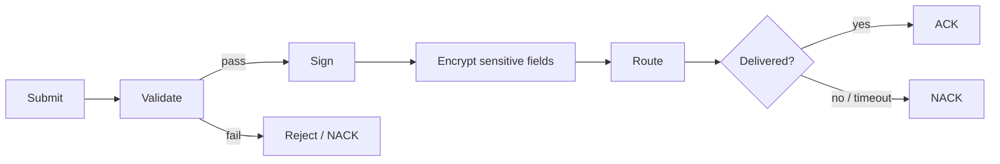
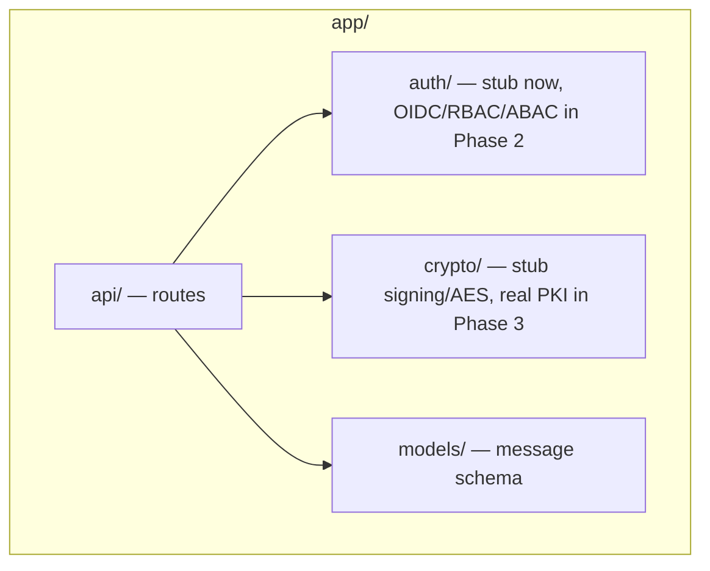
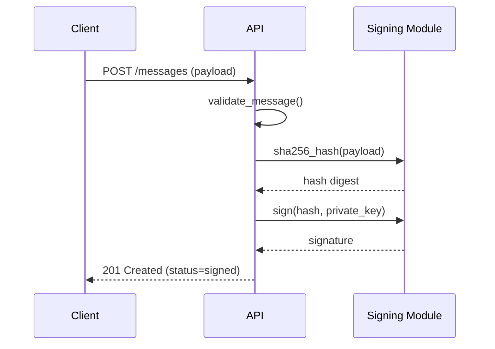
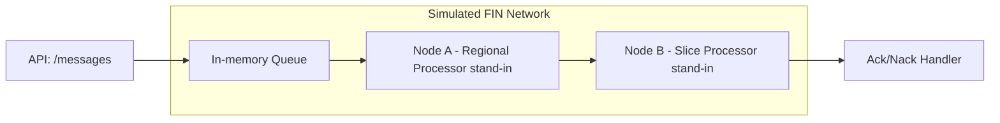
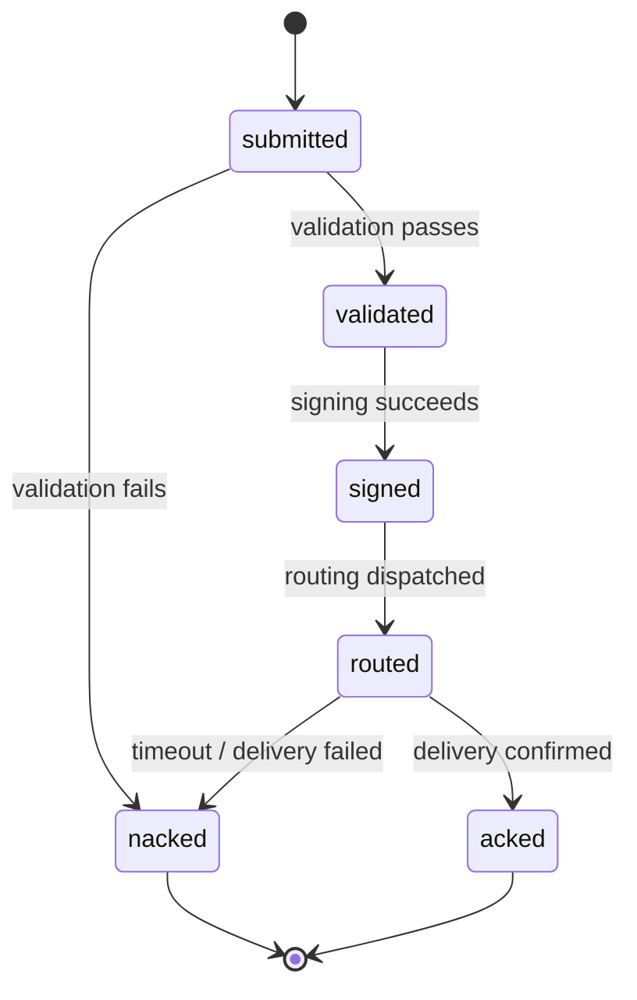
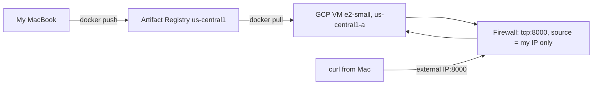

# Phase 1 Runbook: Core Messaging API
## SWIFT-Style DevSecOps Lab — Setup Guide & Runbook (As-Built)

This document reflects what I actually built, including the real issues I hit
and how I fixed them — not just the clean happy path. Every command below is
the exact command I ran, with real project/repo/IP values substituted in
where relevant.

---

## 1. Overview & Objective

This phase builds the foundational service for my lab: a simplified payment-message
processing API modeled on the SWIFT FIN message lifecycle I operated at SWIFT
(DVT, ANDES, OMS). It is the target application that every later phase — identity,
PKI, secrets, CI/CD, IaC, Kubernetes, AI-driven triage — will attach to.

**"Production-equivalent" for this phase means:**
- The app runs as a container, deployed to a real GCP VM, not just `localhost`
- Every design decision (schema, signing, encryption, logging) mirrors a real
  operational control
- The container is vulnerability-scanned, remediated, and hardened to run
  non-root — not just "it works"
- Access is IAM-scoped and firewall-restricted, not left wide open

> **Interviewer lens:** Be ready to explain why this phase deliberately stubs
> auth and PKI rather than building them half-baked here — separation of concerns
> and incremental hardening is itself a DevSecOps talking point.

---

## 2. Message Lifecycle Concept



- **Submit** — client posts a message (equivalent to an LT originating a FIN message)
- **Validate** — schema + business-rule checks
- **Sign** — SHA-256 hash + signature for integrity/non-repudiation
- **Encrypt** — AES-encrypt sensitive fields before routing
- **Route** — hand off to a destination endpoint (stand-in for RP/SP processing)
- **ACK/NACK** — acknowledgment tracking, same concept ANDES/OMS monitor

---

## 3. Prerequisites — Actual Precheck Results

Before installing anything, I checked what was already on my MacBook:

```bash
python3 --version
python3 -m venv --help
docker --version
docker compose version
gcloud --version
```

**Actual results:**

| Tool | Found | Status |
|---|---|---|
| Python | 3.14.4 | present, but see §3a — caused a real problem |
| Docker | 24.0.6 | ✅ good |
| Docker Compose | v2.22.0 | ✅ good |
| gcloud CLI | 576.0.0 | ✅ good |

No fresh installs were needed for Docker or gcloud. Python needed a version
downgrade within the venv — see §3a.

---

## 3a. Environment Precheck Issue — Python 3.14 Incompatibility

**What happened:** I created the venv with the default Python 3.14.4, then ran:

```bash
pip install --upgrade pip
pip install -r requirements.txt
```

This failed while building `pydantic-core`:
```
error: the configured Python interpreter version (3.14) is newer than PyO3's
maximum supported version (3.13)
💥 maturin failed
ERROR: Failed building wheel for pydantic-core
```

**Diagnosis:** `pydantic-core` is written in Rust and built via PyO3/maturin.
At the time of this build, PyO3 didn't yet support Python 3.14, so there was
no prebuilt wheel and no way to compile it either.

**Fix — switch the venv to Python 3.13:**

```bash
# Check for an already-installed 3.12 or 3.13 before installing anything new
which python3.12
which python3.13
# → /opt/homebrew/bin/python3.13 (already installed via Homebrew — no install needed)

# Rebuild the venv on 3.13 specifically
cd ~/swift-devsecops-lab/app
rm -rf .venv
/opt/homebrew/bin/python3.13 -m venv .venv
source .venv/bin/activate
python3 --version
# → Python 3.13.14

pip install --upgrade pip
pip install -r requirements.txt
```

This installed cleanly — `pydantic-core` and `cryptography` both had prebuilt
wheels for 3.13.

**Verification:**
```bash
python3 -c "import fastapi, pydantic, cryptography, uvicorn; print('all imports OK')"
# → all imports OK
```

> **Interview talking point:** this is a real "bleeding-edge tooling breaks
> the build" scenario — diagnosing a Rust/PyO3 build failure and picking a
> pragmatic fix (pin to the last fully-supported Python minor version) rather
> than fighting the new version is a realistic day-one-of-a-new-project problem.

---

## 4. Project Scaffolding



```bash
cd ~/swift-devsecops-lab/app
mkdir -p src/api src/auth src/crypto src/models tests

touch src/__init__.py
touch src/api/__init__.py src/api/routes.py src/api/validation.py src/api/routing.py src/api/audit.py
touch src/auth/__init__.py src/auth/stub_auth.py
touch src/crypto/__init__.py src/crypto/signing.py src/crypto/encryption.py
touch src/models/__init__.py
touch src/main.py
touch tests/__init__.py
```

Separation matters here: `api/` never talks to Keycloak or a real CA directly —
it calls `auth/` and `crypto/` as internal interfaces, so Phase 2/3 can swap
implementations without touching `api/`.

```
app/
├── src/
│   ├── api/{routes,validation,routing,audit}.py
│   ├── auth/stub_auth.py        # placeholder — replaced in Phase 2
│   ├── crypto/{signing,encryption}.py
│   ├── models/message.py
│   └── main.py
├── tests/
├── Dockerfile
├── requirements.txt
└── .env.example
```

---

## 5. Message Schema Design

| Field | Type | Required | Validation Rule |
|---|---|---|---|
| `message_id` | string (UUID) | yes | auto-generated, unique |
| `sender_id` | string | yes | non-empty, max 35 chars (BIC-length constraint) |
| `receiver_id` | string | yes | non-empty, max 35 chars |
| `amount` | decimal | yes | > 0, max 2 decimal places |
| `currency` | string | yes | ISO 4217 3-letter code |
| `account_number` | string | yes | encrypted at rest (§8) |
| `timestamp` | datetime | yes | auto-generated, UTC-aware (see fix below) |
| `status` | enum | yes | see state diagram §10 |
| `schema_version` | string | yes | e.g. `"1.0"` |

```python
# src/models/message.py
from pydantic import BaseModel, Field
from decimal import Decimal
from datetime import datetime, UTC   # UTC import needed for the fix below
from enum import Enum
import uuid

class MessageStatus(str, Enum):
    SUBMITTED = "submitted"
    VALIDATED = "validated"
    SIGNED = "signed"
    ROUTED = "routed"
    ACKED = "acked"
    NACKED = "nacked"

class PaymentMessage(BaseModel):
    # auto-generated fields — client never sets these directly
    message_id: str = Field(default_factory=lambda: str(uuid.uuid4()))
    # timezone-aware UTC timestamp. Originally this used datetime.utcnow(),
    # which is deprecated as of Python 3.12+ (returns a naive datetime that's
    # easy to misinterpret). Fixed to datetime.now(UTC) — see §11a.
    timestamp: datetime = Field(default_factory=lambda: datetime.now(UTC))
    status: MessageStatus = MessageStatus.SUBMITTED
    schema_version: str = "1.0"

    # client-provided fields
    sender_id: str = Field(..., max_length=35)
    receiver_id: str = Field(..., max_length=35)
    amount: Decimal = Field(..., gt=0, decimal_places=2)
    currency: str = Field(..., min_length=3, max_length=3)
    account_number: str  # will be encrypted before persistence — see §8
```

---

## 6. Validation Layer

```python
# src/api/validation.py
from decimal import Decimal
from src.models.message import PaymentMessage

class ValidationError(Exception):
    """Raised when a message fails business-rule validation."""
    pass

def validate_message(msg: PaymentMessage) -> None:
    # Pydantic already enforces type/format constraints (see models/message.py).
    # This layer adds business rules Pydantic can't express declaratively.

    if msg.sender_id == msg.receiver_id:
        raise ValidationError("sender_id and receiver_id must differ")

    if msg.amount > Decimal("1000000.00"):
        # Arbitrary large-amount guardrail — mirrors real payment
        # controls that flag high-value transactions for extra review.
        raise ValidationError("amount exceeds single-message limit")

    # Currency allow-list keeps the demo scoped; a real system would
    # check against an ISO 4217 reference table.
    if msg.currency not in {"USD", "EUR", "GBP", "INR"}:
        raise ValidationError(f"unsupported currency: {msg.currency}")
```

**Failure modes:**

| Failure | HTTP Status | Response |
|---|---|---|
| Missing required field | 422 | Pydantic validation error detail |
| Business rule violation | 400 | `{"error": "<reason>"}`, status → NACKED |
| Duplicate `message_id` | 409 | conflict, message rejected |

---

## 7. Signing & Integrity



**Generate the Phase 1 stub signing key:**
```bash
mkdir -p keys
python3 << 'EOF'
from cryptography.hazmat.primitives.asymmetric import rsa
from cryptography.hazmat.primitives import serialization

private_key = rsa.generate_private_key(public_exponent=65537, key_size=2048)

with open("keys/signing_key.pem", "wb") as f:
    f.write(private_key.private_bytes(
        encoding=serialization.Encoding.PEM,
        format=serialization.PrivateFormat.PKCS8,
        encryption_algorithm=serialization.NoEncryption(),
    ))
print("key generated")
EOF

chmod 600 keys/signing_key.pem
echo "keys/" >> .gitignore
```

```python
# src/crypto/signing.py
import hashlib
from cryptography.hazmat.primitives import hashes, serialization
from cryptography.hazmat.primitives.asymmetric import padding

def hash_message(payload_bytes: bytes) -> bytes:
    """SHA-256 hash of the canonical message bytes (integrity check)."""
    return hashlib.sha256(payload_bytes).digest()

def sign_message(payload_bytes: bytes, private_key) -> bytes:
    """
    Sign the message hash with the service's private key.
    NOTE: private_key here is loaded from a local PEM file for Phase 1 only.
    Explicitly NOT production-safe — Phase 4 replaces this with Vault/GSM,
    Phase 3 replaces the self-signed key with a real mini-CA cert.
    """
    return private_key.sign(
        payload_bytes,
        padding.PSS(
            mgf=padding.MGF1(hashes.SHA256()),
            salt_length=padding.PSS.MAX_LENGTH,
        ),
        hashes.SHA256(),
    )
```

> **Temporary secrets handling (Phase 1 only):** the signing key is read from
> a local file with `chmod 600` permissions and is git-ignored. This is a
> stub, not a real secrets-management control — Phase 4 replaces it.

> **Interviewer lens:** signing happens *before* encrypting (§8) so a
> downstream verifier can check integrity without decrypting first.

---

## 8. Encryption for Sensitive Fields

```python
# src/crypto/encryption.py
from cryptography.hazmat.primitives.ciphers.aead import AESGCM
import os

def encrypt_field(plaintext: str, key: bytes) -> tuple[bytes, bytes]:
    """
    Encrypt a sensitive field (e.g., account_number) using AES-256-GCM.
    GCM gives confidentiality AND integrity in one step — no separate MAC needed.
    """
    aesgcm = AESGCM(key)
    nonce = os.urandom(12)  # 96-bit nonce, required unique per encryption
    ciphertext = aesgcm.encrypt(nonce, plaintext.encode(), associated_data=None)
    return ciphertext, nonce

def decrypt_field(ciphertext: bytes, nonce: bytes, key: bytes) -> str:
    aesgcm = AESGCM(key)
    plaintext = aesgcm.decrypt(nonce, ciphertext, associated_data=None)
    return plaintext.decode()
```

**Generate the dev AES key and add to `.env`:**
```bash
python3 -c "import os, base64; print(base64.b64encode(os.urandom(32)).decode())"
# → example output: vWlzUwqX6E9CSszH2Vay5S8TaCY6Uc5WPl3uODYep3Y=

cat > .env << 'EOF'
SIGNING_KEY_PATH=./keys/signing_key.pem
AES_KEY=<paste-generated-key-here>
LOG_LEVEL=INFO
PORT=8000
EOF

cat > .env.example << 'EOF'
SIGNING_KEY_PATH=./keys/signing_key.pem
AES_KEY=<base64-encoded-32-byte-key>
LOG_LEVEL=INFO
PORT=8000
EOF

echo ".env" >> .gitignore
```

---

## 9. Routing Logic



```python
# src/api/routing.py
import time
import logging

logger = logging.getLogger("routing")

def route_message(msg) -> bool:
    """Simulated routing between two in-memory 'nodes'. Logs stage timing
    to give DVT-style transit metrics — see §11a SLA note."""
    start = time.monotonic()

    node_a_ok = _deliver_to_node(msg, node="A")
    node_b_ok = _deliver_to_node(msg, node="B") if node_a_ok else False

    elapsed_ms = (time.monotonic() - start) * 1000
    logger.info(
        "routing_complete message_id=%s elapsed_ms=%.2f success=%s",
        msg.message_id, elapsed_ms, node_b_ok
    )
    return node_b_ok

def _deliver_to_node(msg, node: str) -> bool:
    # Placeholder — always succeeds for Phase 1. Real failure injection
    # (timeouts, node-down simulation) is a stretch goal.
    logger.info("delivered message_id=%s to node=%s", msg.message_id, node)
    return True
```

---

## 10. Acknowledgment & Status Tracking



**Idempotency:** retrying with the same `message_id` returns the existing
status instead of double-processing — mirrors duplicate FIN message detection.

| Failure Mode | Response Status | Resulting Message Status |
|---|---|---|
| Schema/validation failure | 400/422 | `nacked` |
| Signing failure | 500 | `nacked`, logged as internal error |
| Routing timeout | 504 | `nacked` |
| Duplicate `message_id` on retry | 200 | unchanged |

---

## 11. Audit Logging

```python
# src/api/audit.py
import logging
import json

audit_logger = logging.getLogger("audit")

def log_transition(message_id: str, from_status: str, to_status: str, **extra):
    """Structured audit log for every status transition — JSON format so it
    can later ship to Cloud Logging / a SIEM without reformatting."""
    audit_logger.info(json.dumps({
        "event": "status_transition",
        "message_id": message_id,
        "from": from_status,
        "to": to_status,
        **extra,  # e.g. elapsed_ms from routing, for DVT-style SLA tracking
    }))
```

> **SLA/timing note:** the `elapsed_ms` field logged in §9 and threaded
> through here is a direct nod to what DVT measures on the real network —
> transit time against SLA thresholds.

---

## 11a. Deprecation Fix — datetime.utcnow()

While running the test suite, I noticed this warning:
```
DeprecationWarning: datetime.datetime.utcnow() is deprecated and scheduled
for removal in a future version. Use timezone-aware objects instead:
datetime.datetime.now(datetime.UTC).
```

**Fix applied to `src/models/message.py`:**
```diff
- from datetime import datetime
+ from datetime import datetime, UTC
  ...
- timestamp: datetime = Field(default_factory=datetime.utcnow)
+ timestamp: datetime = Field(default_factory=lambda: datetime.now(UTC))
```

Re-ran `pytest -v` — all 10 tests still passed, warning gone.

---

## 12. Testing

```bash
echo "pytest==8.3.3" >> requirements.txt
pip install pytest==8.3.3
```

*(Note: `pytest` was later bumped to `9.0.3` as part of the vulnerability
remediation pass — see §13a.)*

| Component | What's tested |
|---|---|
| `validation.py` | valid message passes; each business rule fails correctly |
| `signing.py` | sign→verify round-trip; tampered payload fails verification |
| `encryption.py` | encrypt→decrypt round-trip; tampered ciphertext rejected |
| `routing.py` | routing completes, logs expected fields |

```python
# tests/test_signing.py (excerpt)
def test_signature_detects_tampering(keypair):
    """A tampered payload must fail verification — this is the core
    integrity guarantee the whole signing module exists to provide."""
    private_key, public_key = keypair
    original = b"payload-bytes"
    tampered = b"payload-BYTES"  # one case flip — payload has changed
    signature = sign_message(original, private_key)
    with pytest.raises(InvalidSignature):
        public_key.verify(signature, tampered, ...)
```

**Run the suite:**
```bash
pytest -v
```

### 12a. Real Gotcha — pytest Resolving to the Wrong Python

First run showed an unexpected header:
```
platform darwin -- Python 3.14.4, pytest-9.1.1, pluggy-1.6.0 --
/opt/homebrew/opt/python@3.14/bin/python3.14
```

This meant `pytest` on my `PATH` was resolving to a **global Homebrew
install**, not the project's `.venv` — even though the venv showed as active
in the shell prompt.

**Diagnosis:**
```bash
which python3
# → /Users/testuser/swift-devsecops-lab/app/.venv/bin/python3   (correct)
which pytest
# → /opt/homebrew/bin/pytest                                    (WRONG — global)
```

**Fix — clear the shell's cached command location:**
```bash
hash -r
which pytest
# → /Users/testuser/swift-devsecops-lab/app/.venv/bin/pytest    (correct now)

pytest -v
# → platform darwin -- Python 3.13.14, pytest-8.3.3 ... 10 passed
```

> **Lesson:** a shell can cache a command's resolved path from before a venv
> was activated. `hash -r` clears that cache. Always check `which <tool>`
> against the venv path, not just the prompt prefix, when results look
> suspicious (e.g., unexpected version numbers in tool output headers).

---

## 13. Containerization

```bash
cat > Dockerfile << 'EOF'
FROM python:3.13-slim

WORKDIR /app

COPY requirements.txt .
RUN pip install --no-cache-dir -r requirements.txt

COPY src/ ./src/
# Signing key and .env are NOT copied into the image — mounted at runtime
# instead, so the image never contains key material or secrets.

# Non-root hardening — see §13b for why this was added and how it was verified.
RUN useradd --create-home --shell /bin/bash appuser
USER appuser

EXPOSE 8000
CMD ["uvicorn", "src.main:app", "--host", "0.0.0.0", "--port", "8000"]
EOF

cat > .dockerignore << 'EOF'
.venv/
keys/
.env
__pycache__/
*.pyc
.pytest_cache/
.git/
EOF

docker build -t swift-lab-app:phase1 .
```

---

## 13a. Vulnerability Scanning & Remediation

**Baseline scan:**
```bash
docker scout quickview swift-lab-app:phase1
```
```
Target     │ swift-lab-app:phase1  │  2C  9H  12M  30L  5?
Base image │ python:3.13-slim      │  2C  2H   6M  28L  5?
```

Full detail:
```bash
docker scout cves swift-lab-app:phase1
```

**Findings triaged into two buckets:**

*Not fixable now (Debian base OS packages — `perl`, `tar`, `util-linux`,
`glibc`, `systemd`, `coreutils`, etc.)* — every one showed `Fixed version:
not fixed` upstream. Nothing actionable beyond documenting as a known,
accepted baseline; switching base images (e.g., distroless) is a Phase 5
decision, not a Phase 1 fix.

*Fixable — pinned Python packages had patches available:*

| Package | Before | After | What it fixed |
|---|---|---|---|
| `cryptography` | 46.0.3 | 50.0.0 | 4 HIGH CVEs (2 not even exploitable in our usage — no cert-chain validation or PKCS#7 decryption in this code) |
| `fastapi` | 0.115.0 | 0.136.1 | raised the allowed `starlette` range |
| `starlette` (transitive) | 0.38.6 | 1.6.0 | 5 HIGH/MEDIUM/LOW CVEs (SSRF, resource exhaustion, unsafe reflection) |
| `pytest` | 8.3.3 | 9.0.3 | 1 MEDIUM (insecure temp file permissions) — test-only, low real risk |

**Update `requirements.txt`:**
```bash
cat > requirements.txt << 'EOF'
fastapi==0.136.1
starlette>=1.3.1
uvicorn[standard]==0.32.0
pydantic==2.9.2
cryptography==50.0.0
python-dotenv==1.2.2
pytest==9.0.3
EOF

pip install -r requirements.txt --upgrade
pytest -v   # confirm all 10 still pass after the bumps
```

> **Why `starlette` needed a manual bump too:** `pip install --upgrade` only
> force-upgrades packages named directly in `requirements.txt`. Since the
> already-installed `starlette==0.50.0` satisfied FastAPI's `>=0.46.0`
> constraint, pip left it alone. Had to upgrade it explicitly:
> ```bash
> pip install --upgrade "starlette>=1.3.1"
> # → resolved to starlette==1.6.0
> ```

**Rebuild and re-scan:**
```bash
docker build -t swift-lab-app:phase1 .
docker scout quickview swift-lab-app:phase1
```
```
Target     │ swift-lab-app:phase1  │  2C  2H  6M  28L  5?
Base image │ python:3.13-slim      │  2C  2H  6M  28L  5?
```

**Result: Target now exactly matches the base image floor** — every
vulnerability contributed by our own Python packages is gone.

| Stage | Critical | High | Medium | Low | Unspecified |
|---|---|---|---|---|---|
| Initial | 2 | 9 | 12 | 30 | 5 |
| **Final** | **2** | **2** | **6** | **28** | **5** |

---

## 13b. Non-Root Hardening

**Finding:**
```bash
docker run --rm swift-lab-app:phase1 whoami
# → root
```

The original Dockerfile never set a `USER`, so the container ran as root by
default — unnecessary privilege.

**Fix** (added to the Dockerfile shown in §13):
```dockerfile
RUN useradd --create-home --shell /bin/bash appuser
USER appuser
```

**Verification after rebuild:**
```bash
docker build -t swift-lab-app:phase1 .
docker run --rm swift-lab-app:phase1 whoami
# → appuser

# Also confirmed on an actually-running container, not just a one-off:
docker top swift-lab-test
# → UID 1000 ... uvicorn src.main:app ...   (1000 = appuser's UID, not root/0)
```

**Also verified no secrets leaked into the image:**
```bash
docker run --rm swift-lab-app:phase1 sh -c "ls -la /app && find / -name '*.env' -o -name '*.pem' 2>/dev/null"
```
`/app` contained only `requirements.txt` and `src/` — no `.env`, no `keys/`.
The only `.pem` matches found were public CA root certificates bundled with
the base image (`certifi`, `/etc/ssl/certs/*`) — normal and expected, not secrets.

**Dockerfile lint:**
```bash
docker run --rm -i hadolint/hadolint < Dockerfile
```
No output = zero issues found.

---

## 14. Local Run (venv path)

```bash
source .venv/bin/activate
uvicorn src.main:app --reload
```

**Environment variables:**

| Variable | Purpose | Example |
|---|---|---|
| `SIGNING_KEY_PATH` | path to Phase 1 stub signing key | `./keys/signing_key.pem` |
| `AES_KEY` | base64-encoded 256-bit AES key (dev only) | `<base64 string>` |
| `LOG_LEVEL` | app log verbosity | `INFO` |
| `PORT` | service port | `8000` |

---

## 15. GCP Project & Registry Setup

**Created a dedicated project rather than using the default "My First Project"**
— cleaner IAM boundary, clearer billing/credit tracking, and a stronger
interview narrative than "I used the default project."

- Project name: `swift-devsecops-lab`
- Project ID: `swift-devsecops-lab-01`
- Billing account: confirmed linked to the free-trial billing account
  ($299.27 credit, 57 days remaining at time of creation)

```bash
gcloud config set project swift-devsecops-lab-01
gcloud config list
# → project = swift-devsecops-lab-01   (confirmed)

gcloud services enable compute.googleapis.com artifactregistry.googleapis.com
```

**Region/zone decision:** created the Artifact Registry repo in `us-central1`
before setting gcloud defaults. Rather than deleting and recreating in
`us-west1` (marginally closer to Mountain View, CA, but no meaningful
difference for a solo lab), aligned gcloud defaults to match the repo instead:

```bash
gcloud config set compute/region us-central1
gcloud config set compute/zone us-central1-a
```

**Create the Artifact Registry repo:**
```bash
gcloud artifacts repositories create swift-lab-repo \
  --repository-format=docker \
  --location=us-central1 \
  --description="SWIFT DevSecOps lab - Phase 1 images"
```

**Authenticate Docker to Artifact Registry:**
```bash
gcloud auth configure-docker us-central1-docker.pkg.dev
# (confirm with Y when prompted)
```

---

## 16. Deploy to GCP VM



**Tag and push the image:**
```bash
docker tag swift-lab-app:phase1 \
  us-central1-docker.pkg.dev/swift-devsecops-lab-01/swift-lab-repo/swift-lab-app:phase1

docker push \
  us-central1-docker.pkg.dev/swift-devsecops-lab-01/swift-lab-repo/swift-lab-app:phase1
```

**Provision the VM** (Container-Optimized OS — Docker pre-installed, no manual setup needed):
```bash
gcloud compute instances create swift-lab-vm \
  --zone=us-central1-a \
  --machine-type=e2-small \
  --image-family=cos-stable \
  --image-project=cos-cloud \
  --tags=swift-lab
```

**Create the firewall rule** (initially open, restricted to my IP later — see §16d):
```bash
gcloud compute firewall-rules create allow-lab-app \
  --allow=tcp:8000 \
  --target-tags=swift-lab \
  --description="Phase 1 lab app access"
```

**SSH into the VM:**
```bash
gcloud compute ssh swift-lab-vm --zone=us-central1-a
```

From here, three real issues came up in sequence — each is documented below
with its actual fix.

### 16a. Issue — IAM Permission Denied Pulling the Image

```bash
# on the VM
docker-credential-gcr configure-docker --registries=us-central1-docker.pkg.dev
docker pull us-central1-docker.pkg.dev/swift-devsecops-lab-01/swift-lab-repo/swift-lab-app:phase1
```
```
Error response from daemon: ... denied: Permission
'artifactregistry.repositories.downloadArtifacts' denied ...
```

**Diagnosis:** the VM's service account had no read grant on the Artifact
Registry repo. Found the VM's service account (its **default Compute Engine
service account** — worth noting: this is shared across every VM in the
project unless a dedicated one is explicitly assigned; a production setup
would use a dedicated service account scoped per-app):

```bash
# on the Mac
gcloud compute instances describe swift-lab-vm \
  --zone=us-central1-a \
  --format="value(serviceAccounts[0].email)"
# → 579899207455-compute@developer.gserviceaccount.com
```

**Fix — grant least-privilege read access, scoped to just this repo (not project-wide):**
```bash
gcloud artifacts repositories add-iam-policy-binding swift-lab-repo \
  --location=us-central1 \
  --member="serviceAccount:579899207455-compute@developer.gserviceaccount.com" \
  --role="roles/artifactregistry.reader"
```

Retried the pull on the VM — succeeded.

### 16b. Issue — Architecture Mismatch (arm64 vs amd64)

```bash
docker run -d -p 8000:8000 -v ~/keys:/app/keys:ro --env-file ~/.env \
  --name swift-lab-app \
  us-central1-docker.pkg.dev/swift-devsecops-lab-01/swift-lab-repo/swift-lab-app:phase1
```
```
WARNING: The requested image's platform (linux/arm64/v8) does not match
the detected host platform (linux/amd64/v3)
```
```bash
docker logs swift-lab-app
# → exec /usr/local/bin/uvicorn: exec format error
```

**Diagnosis:** the image was built on my Apple Silicon (arm64) Mac using a
plain `docker build`, which defaults to the host's architecture. The GCP
`e2-small` VM runs standard x86_64 (amd64) — the arm64 binary literally
cannot execute there.

**Fix — cross-compile explicitly for amd64, back on the Mac:**
```bash
docker buildx build --platform linux/amd64 -t swift-lab-app:phase1 --load .
```
(Took ~48s vs the usual few seconds — that's the cross-architecture
emulation overhead during `pip install`.)

**Re-tag and re-push:**
```bash
docker tag swift-lab-app:phase1 \
  us-central1-docker.pkg.dev/swift-devsecops-lab-01/swift-lab-repo/swift-lab-app:phase1
docker push \
  us-central1-docker.pkg.dev/swift-devsecops-lab-01/swift-lab-repo/swift-lab-app:phase1
```

**On the VM — remove the old container/image reference and pull fresh:**
```bash
docker rm swift-lab-app
docker pull us-central1-docker.pkg.dev/swift-devsecops-lab-01/swift-lab-repo/swift-lab-app:phase1
docker image ls
```
New image confirmed at **194MB** (amd64) vs the old **219MB** (arm64) — a
useful side data point on binary size differences between architectures.

### 16c. Issue — Container UID vs. Host File Permissions

Re-ran the container with the new amd64 image — it started, but crashed:
```bash
docker logs swift-lab-app
# → PermissionError: [Errno 13] Permission denied: './keys/signing_key.pem'
```

**Diagnosis, step by step:**
```bash
ls -la ~/keys/signing_key.pem
# → -rw------- 1 testuser testuser 1704 ...   (600, owner-only)
id
# → uid=20162(testuser) gid=20166(testuser) ...
```
The container's `appuser` runs as **UID 1000** inside the container — a
completely different identity than the VM's host user (UID 20162). A `600`
file owned by `testuser` is correctly unreadable by a different UID.

**First attempt — `chown` the key file directly:**
```bash
sudo chown 1000:1000 ~/keys/signing_key.pem
chmod 600 ~/keys/signing_key.pem
```
This alone wasn't enough — still failed. Checked the parent directories:
```bash
ls -ld ~/keys
# → drwxr-x--- 2 testuser testuser ...   (750 — no access for "other")
ls -ld ~
# → drwxr-x--- 5 testuser testuser ...   (750 — same problem)
```
Even with correct file ownership, the container's user couldn't **traverse**
into `~` or `~/keys` to reach the file at all, since "other" had zero
permission on both directories.

**Second attempt — move the key to a neutral location:**
```bash
sudo mkdir -p /opt/swift-lab/keys
# → mkdir: cannot create directory '/opt/swift-lab': Read-only file system
```
Container-Optimized OS intentionally ships with a **read-only root
filesystem** as a security hardening feature — `/opt`, `/usr`, etc. can't be
written to at all. This ruled out the "just use a different directory" fix.

**Actual fix — grant execute-only (traversal) permission on the existing
home directory and `keys/` folder, without granting read/list access:**
```bash
chmod o+x /home/testuser
chmod o+x /home/testuser/keys
sudo chown 1000:1000 /home/testuser/keys/signing_key.pem
chmod 600 /home/testuser/keys/signing_key.pem
```
`o+x` on a directory allows *entering* it (if you already know the exact
filename) without allowing *listing* its contents — a meaningfully tighter
grant than making the directory world-readable.

**Restarted the container — worked:**
```bash
docker rm swift-lab-app
docker run -d -p 8000:8000 -v ~/keys:/app/keys:ro --env-file ~/.env \
  --name swift-lab-app \
  us-central1-docker.pkg.dev/swift-devsecops-lab-01/swift-lab-repo/swift-lab-app:phase1

docker logs swift-lab-app
# → Application startup complete.
```

> **Interview talking point:** this is a genuinely realistic container/host
> boundary problem — UID namespaces don't automatically align between a
> container's internal users and the host's users, and a hardened read-only-
> root OS (a real security feature) can rule out the "obvious" fix. The
> execute-only-directory approach is the more precise, least-privilege
> resolution versus broadly opening file permissions.

### 16d. Firewall Restriction — Narrowing from Open Internet to My IP

The firewall rule created in §16 initially allowed `tcp:8000` from any
source. Restricted it to just my own IP:

```bash
# Get my actual public IPv4 (not IPv6, which rotates more unpredictably
# on many home networks)
curl -s -4 ifconfig.me
# → 73.222.199.63

gcloud compute firewall-rules update allow-lab-app \
  --source-ranges=73.222.199.63/32
```

> **Known limitation, documented rather than solved here:** home ISP IPs can
> still change over time (less often than IPv6, but it happens) — if `curl`
> to the VM stops working later, checking whether this IP changed is the
> first thing to try. A production setup would use a VPN, bastion host, or
> Identity-Aware Proxy (IAP) tunnel instead of IP allowlisting, specifically
> to avoid this fragility.

---

## 17. Verification / Smoke Test — Against the Real Deployed VM

**On the VM, first:**
```bash
curl http://localhost:8000/health
# → {"status":"ok"}
```

**Then from the Mac, against the real external IP, over the public internet:**
```bash
curl http://136.113.112.98:8000/health
# → {"status":"ok"}

curl -X POST http://136.113.112.98:8000/messages \
  -H "Content-Type: application/json" \
  -d '{
    "sender_id": "BANKUS33",
    "receiver_id": "BANKGB22",
    "amount": 1500.00,
    "currency": "USD",
    "account_number": "1234567890"
  }'
```

**Actual response:**
```json
{
  "message_id": "fbf998e1-4475-4030-9e09-1bd6ea8477ea",
  "timestamp": "2026-08-10T05:55:06.504899Z",
  "status": "acked",
  "schema_version": "1.0",
  "sender_id": "BANKUS33",
  "receiver_id": "BANKGB22",
  "amount": "1500.0",
  "currency": "USD",
  "account_number": "69w13k1EF7ZNnVCol47Tv65KcdIF6zhLYS0="
}
```

`status: "acked"` and an encrypted `account_number` — confirms the full
validate → sign → encrypt → route → ack pipeline works end-to-end on real
deployed infrastructure, not just locally.

---

## 18. Troubleshooting — Consolidated Real Issue Log

| # | Symptom | Root Cause | Fix |
|---|---|---|---|
| 1 | `pydantic-core` build failure | Python 3.14 too new for PyO3/maturin | Rebuilt venv on Python 3.13 |
| 2 | `pytest` header shows wrong Python/pytest version | Shell's cached PATH pointed to global Homebrew pytest, not venv's | `hash -r` to clear shell command cache |
| 3 | 58 vulnerabilities in Docker Scout scan | Outdated pinned versions of `cryptography`, `fastapi`/`starlette`, `pytest` | Bumped to `cryptography==50.0.0`, `fastapi==0.136.1` + `starlette>=1.3.1`, `pytest==9.0.3` |
| 4 | Container ran as root | No `USER` set in Dockerfile | Added `useradd` + `USER appuser` |
| 5 | `denied: Permission 'artifactregistry.repositories.downloadArtifacts'` | VM's service account had no read grant on the repo | Added scoped `roles/artifactregistry.reader` IAM binding |
| 6 | `exec format error` on the VM | Image built for arm64 (Apple Silicon), VM is amd64 | `docker buildx build --platform linux/amd64` |
| 7 | `PermissionError` reading the signing key | Container UID (1000) ≠ host UID; `600` file + `750` directories blocked all cross-UID access; `/opt` unavailable due to COS's read-only root filesystem | `chmod o+x` on home dir + `keys/` (traversal only) + `chown 1000:1000` on the key file specifically |
| 8 | Firewall open to entire internet | Rule created without `--source-ranges` | Restricted to `73.222.199.63/32` (my IP) after the fact |

---

## Lessons Learned / Interview Talking Points

- **Cross-architecture builds are a real, common gotcha** on Apple Silicon
  Macs deploying to standard x86_64 cloud VMs — `docker buildx build
  --platform linux/amd64` is the fix, and knowing to check
  `docker logs` for `exec format error` as the specific signature of this
  problem is worth having ready.
- **Container UID namespaces are independent of host UID namespaces** —
  a file being readable to the container doesn't just depend on Unix
  permission bits, it depends on which UID the container process actually
  runs as, which may have zero relationship to the host user that created
  the file.
- **Hardened base OS images (like Container-Optimized OS's read-only root
  filesystem) can rule out "obvious" fixes** — worth designing around this
  rather than fighting it (e.g., adjusting directory traversal permissions
  instead of trying to write to a protected path).
- **Least-privilege IAM in practice** — the default Compute Engine service
  account is broad by default; explicitly scoping a role binding to just the
  one Artifact Registry repo (rather than granting project-wide access) is
  the kind of concrete "least privilege" example that's easy to talk about
  abstractly but this was hands-on.
- **A vulnerability scan number by itself is meaningless without triage** —
  distinguishing "fixable via a dependency bump" from "base-image OS package
  with no upstream fix yet" is the actual skill, not just running the scanner.

---

## Cost & Cleanup Checkpoint

The VM was stopped after Phase 1 verification to avoid consuming trial
credit while not actively in use:

```bash
gcloud compute instances stop swift-lab-vm --zone=us-central1-a
gcloud compute instances list
# → STATUS: TERMINATED (this means "stopped," not deleted — the VM and
#   its disk persist; only compute billing stops)
```

**Note for next session:** the external IP is ephemeral and will very likely
change on restart:
```bash
gcloud compute instances start swift-lab-vm --zone=us-central1-a
gcloud compute instances describe swift-lab-vm --zone=us-central1-a \
  --format="value(networkInterfaces[0].accessConfigs[0].natIP)"
```
The firewall rule's `--source-ranges` (my IP) may also need re-checking if
my home IP has changed since — see §16d.

This ties back to the trial account's $299.27 credit / 57-day window noted
at project creation — stopping the VM between working sessions is the
practical way to stretch that runway.

---

## Git Workflow — As Executed

```bash
cd ~/swift-devsecops-lab/app
git init
git add .
git status
```

**First pass caught stray files that shouldn't be committed** — compiled
`.pyc` bytecode (mixed remnants from Python 3.13/3.14 switching) and an
accidental empty `test` file:

```bash
git reset
rm -f test

cat > .gitignore << 'EOF'
keys/
.env
.venv/
__pycache__/
*.pyc
.pytest_cache/
EOF

find . -name "__pycache__" -type d -exec rm -rf {} + 2>/dev/null

git add .
git status   # confirmed clean — only real source files staged
```

**Before making the repo public, ran three explicit checks rather than
assuming `.gitignore` worked:**

```bash
# 1. Confirm exactly what's in the commit
git log --stat

# 2. Search the full history for anything secret-shaped
git log -p | grep -iE "BEGIN (RSA|PRIVATE) KEY|AES_KEY|SIGNING_KEY_PATH=|password|secret"
# → only matched safe things: file paths, the literal placeholder text
#   "<base64-encoded-32-byte-key>", and variable/parameter names — no
#   actual key material or real secret values

# 3. Confirm .gitignore is actively excluding the right things
git status --ignored
# → .env, .venv/, .pytest_cache/, keys/ all correctly listed as ignored
```

**Committed and renamed the branch:**
```bash
git commit -m "Phase 1: core messaging API - schema, validation, signing, encryption, routing, audit logging"
git branch -m main phase-1-core-api
```

**Connected to GitHub and pushed** (repo created manually via github.com,
started private, switched to public only after the secret-scan checks above
passed):
```bash
git remote add origin https://github.com/kuldeepjain1920/swift-devsecops-lab.git
git push -u origin phase-1-core-api
```

---

## Appendix: JD Mapping

| This Phase Demonstrates | JD Bullet |
|---|---|
| SHA-256 hashing, AES-256-GCM encryption | Cloud Account Security & Identity Security — encryption fundamentals |
| Structured audit logging (JSON) | Detect and Respond / observability foundation for AI triage (Phase 8) |
| Schema versioning, validation-first design | Shift-Left Security culture |
| Vulnerability scanning + triaged remediation (58 → base-image floor) | Application Security — Remediation, Container Scanning |
| Non-root container hardening | Least privilege, secure-by-design |
| Scoped IAM binding (not project-wide) | Machine identity, least-privilege access management |
| Cross-architecture build troubleshooting | Real-world CI/CD / platform engineering judgment |
| Firewall restricted to specific source IP | Cloud account security, network-level least privilege |
| Clean git history with a pre-publish secret scan | Secure SDLC, secrets governance |

