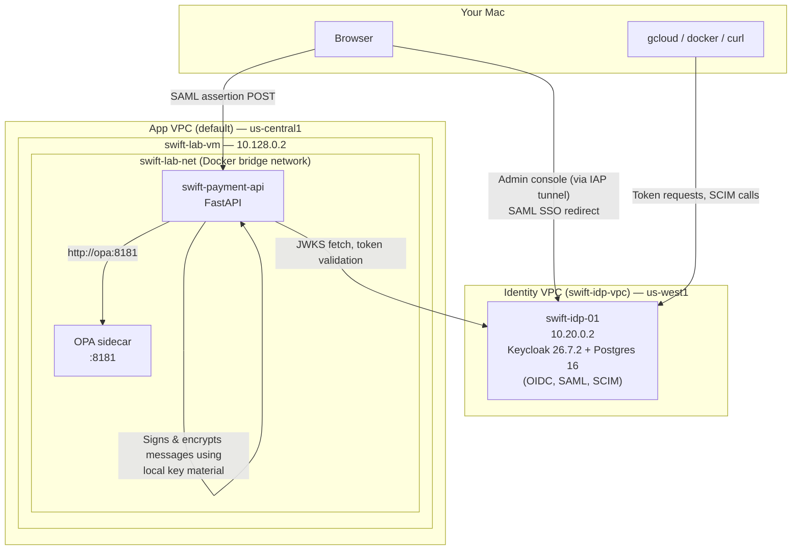
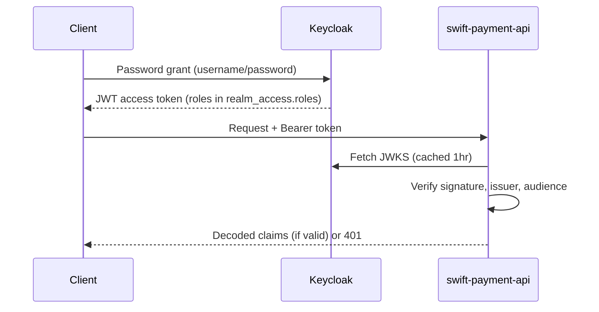
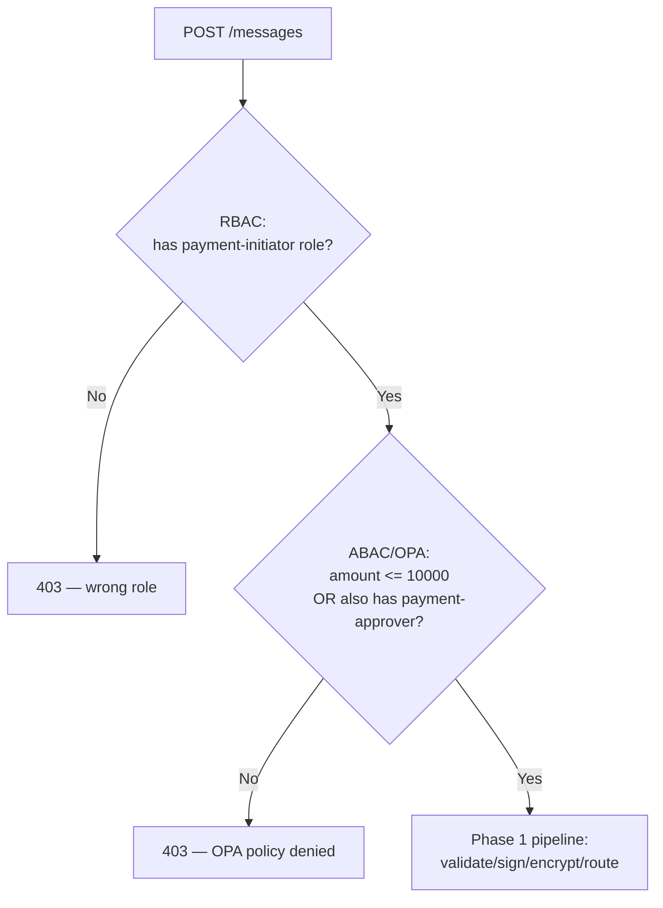
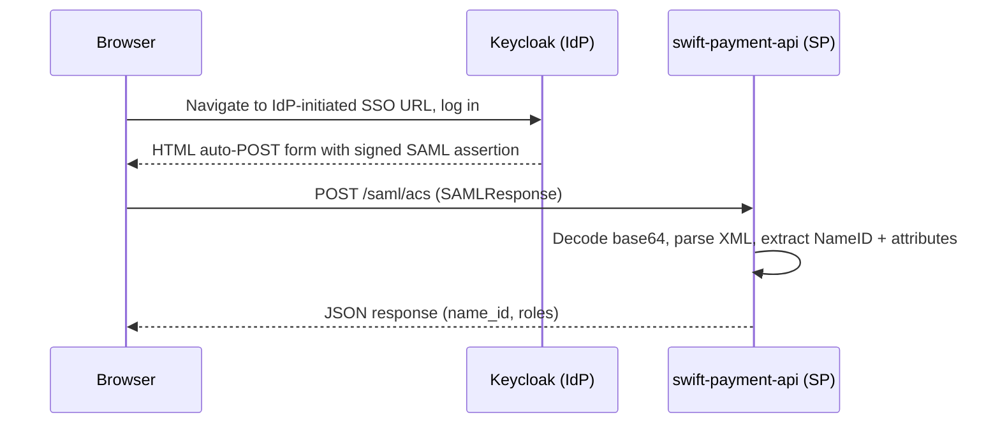
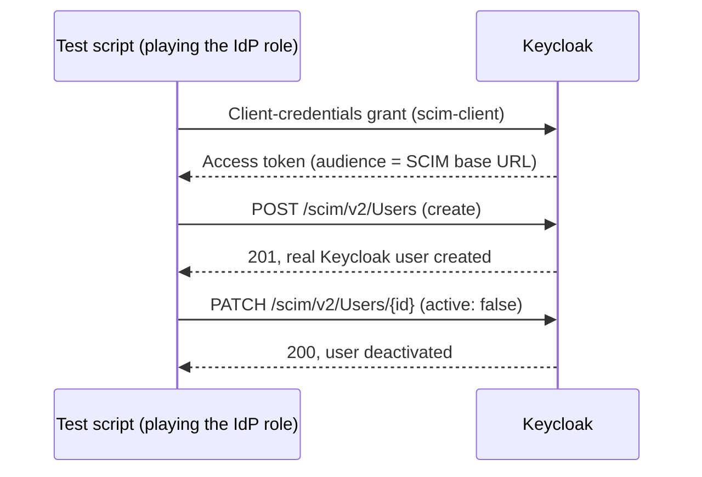

# Architecture

Consolidated system design across everything built so far — Phase 1 (core messaging API) and Phase 2 (identity, authorization, and additional protocols). Individual phase runbooks (`docs/phase1-runbook.md`, `docs/phase2-runbook-part1-identity-oidc.md`, `docs/phase2-runbook-part2-rbac-abac-saml-scim.md`) go into the *why* and the incidents behind each piece; this document is the *what* — one whole-project picture.

---

## 1. System overview



**The two VPCs are bidirectionally peered** — the identity plane (`swift-idp-vpc`) and application plane (default VPC) are deliberately kept as separate networks, matching how a real organization would isolate an identity provider from the applications that consume it.

---

## 2. Component inventory

| Component | Runs on | Purpose |
|---|---|---|
| `swift-payment-api` | swift-lab-vm | FastAPI app — the actual "SWIFT-adjacent" payment message service (Phase 1), now with a full identity/authorization layer (Phase 2) |
| `opa` | swift-lab-vm | Open Policy Agent — evaluates ABAC (attribute-based) authorization decisions via Rego policy |
| `keycloak` | swift-idp-01 | Identity provider — OIDC, SAML, and SCIM all served from here |
| `keycloak-postgres` | swift-idp-01 | Keycloak's backing database |

---

## 3. Phase 1: Core messaging API

The foundational pipeline every request passes through, regardless of which Phase 2 auth layer gates it:


- **Validate** — schema/business-rule checks against the message
- **Sign** — RSA signature over the canonical message bytes, applied *before* encryption so a downstream verifier can check integrity without needing to decrypt first
- **Encrypt** — AES encryption of the `account_number` field specifically, not the whole message
- **Route** — delivers the message (simulated in this lab)
- **Audit log** — every status transition (`submitted` → `validated` → `signed` → `acked`/`nacked`) is logged

**Storage:** in-memory only for this lab — no database in Phase 1. A deliberate simplification to demonstrate the pipeline itself without the added complexity of persistence, which was never in scope.

---

## 4. Phase 2: Identity & Authorization

### 4.1 Authentication layer (OIDC)



Every subsequent authorization layer (RBAC, ABAC) builds on top of this — none of them replace OIDC validation, they add checks *after* it succeeds.

### 4.2 Authorization layers (RBAC + ABAC)



Two independent, composable layers — a request must clear both. RBAC answers "does this role have permission at all"; ABAC answers a finer question that depends on the specific request (the dollar amount), evaluated by OPA against a Rego policy external to the application code.

### 4.3 SAML



`swift-payment-api` acts as the SAML **Service Provider**; Keycloak is the **Identity Provider**. IdP-initiated flow — no AuthnRequest generator needed on the app side. **Signature verification is not implemented** (decode/parse only) — deferred to Phase 3 alongside the OIDC JWKS `verify=True` gap, since both need the same underlying PKI/certificate work.

### 4.4 SCIM



Keycloak itself is the SCIM service provider (native support, added via a 26.0 → 26.7.2 upgrade). No application code involved — SCIM operates directly on Keycloak's own user store, provable via the identical `id` showing up through both the SCIM API and Keycloak's normal Admin API/console.

---

## 5. Authorization decision matrix

The four combinations that fully exercise both authorization layers together:

| Caller | Amount | RBAC | ABAC | Result |
|---|---|---|---|---|
| `test-initiator` | ≤ $10,000 | Pass | Pass | 201 |
| `test-approver` | any | **Fail** | (not reached) | 403 (RBAC) |
| `test-initiator` | > $10,000 | Pass | **Fail** | 403 (ABAC) |
| `test-senior-approver` | > $10,000 | Pass | Pass | 201 |

---

## 6. Network topology

| From | To | Path |
|---|---|---|
| Your Mac browser | Keycloak admin console | SSH tunnel (`--tunnel-through-iap -L 8080:localhost:8080`) |
| Your Mac browser | `swift-payment-api` (SAML callback) | Direct, over `swift-lab-vm`'s ephemeral external IP, firewall-restricted to your IP |
| `swift-payment-api` | Keycloak (JWKS, token validation) | Cross-VPC, via peering, over `10.20.0.2:8080` |
| `swift-payment-api` | OPA | Same-host, via `swift-lab-net` Docker bridge network, container-name resolution |
| Any CLI (SCIM, admin API testing) | Keycloak | Depends on where run — `localhost:8080` when run directly on `swift-idp-01`; `10.20.0.2:8080` cross-VM |

**Known asymmetry:** the app-facing token issuer is hardcoded to `localhost` (matching Keycloak's own `KC_HOSTNAME` config, needed to keep the browser-based admin console working), while actual connectivity for JWKS fetches and cross-VM calls goes through the real internal IP. This split (`ISSUER` vs `KC_BASE_URL` in `oidc.py`) is the direct consequence of the browser having no route to a private VPC IP — see `docs/decisions.md` D8/B2 for the full reasoning.

---

## 7. Deliberate simplifications and their deferral targets

| Gap | Deferred to |
|---|---|
| No real TLS on Keycloak (`start-dev`, HTTP not HTTPS) | Phase 3 |
| SAML assertion signature not verified | Phase 3 |
| OIDC JWKS fetch uses `verify=False`-equivalent (no cert validation) | Phase 3 |
| Credentials in a personal password manager, not Vault/GSM | Phase 4 |
| No real database (Phase 1's in-memory store) | Not yet scheduled |
| Cross-VM SCIM calls unsupported (audience check tied to Keycloak's own hostname) | Not yet needed |

---

## 8. Repository structure

```
swift-devsecops-lab/
├── app/                          # Phase 1: FastAPI service
│   ├── src/
│   │   ├── api/                  # routes.py, validation.py, routing.py, audit.py
│   │   ├── auth/                 # oidc.py (OIDC/RBAC/ABAC/SCIM client code)
│   │   ├── crypto/               # signing.py, encryption.py
│   │   └── models/                # message.py
│   └── requirements.txt
├── terraform/
│   └── phase2-identity/          # VPC, VM, NAT, firewall rules for swift-idp-01
├── identity/
│   ├── keycloak/                 # docker-compose.yml
│   └── opa/
│       ├── policies/             # payment_authz.rego
│       └── tests/                # payment_authz_test.rego
├── docs/                         # all runbooks, architecture, decisions log
└── secure-notes/                 # gitignored — credentials metadata only, no values
```
