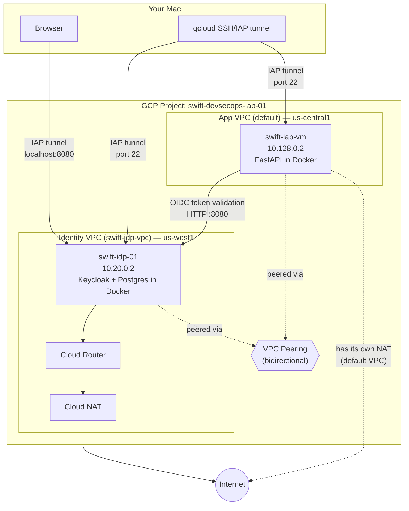
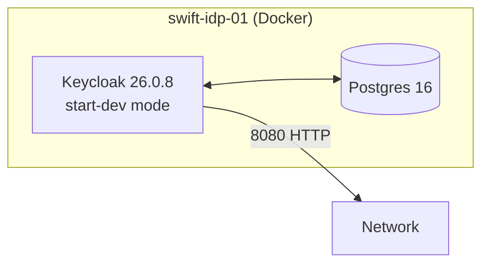

# Phase 2 Runbook — Part 1: Identity & OIDC (Infrastructure, Keycloak, App Integration)

**Status:** Complete and verified end-to-end
**Covers:** VPC/Terraform infrastructure, Keycloak deployment and configuration, FastAPI OIDC integration
**Not covered here:** RBAC, ABAC, SAML, SCIM — completed 9/8/2026, see `phase2-runbook-part2-rbac-abac-saml-scim.md`

---

## 1. Overview & Goals

Phase 2 of the SWIFT DevSecOps lab adds an identity and authorization layer on top of the Phase 1 core messaging API. The original phase scope: **Keycloak, OAuth2/OIDC/SAML/SCIM, RBAC/ABAC**. This document covers the first half of that scope — everything needed to get a working OIDC identity provider talking to the Phase 1 API. Part 2 covers the authorization half (RBAC/ABAC) and the remaining protocols (SAML, SCIM).

**Design principle carried through this phase:** identity infrastructure should be network-isolated from the application tier, the way it typically is in production banking/financial environments — not bolted onto the same VM or VPC as the app. This decision shaped almost every infrastructure choice below, and also caused most of the debugging challenges documented here.

---

## 2. Architecture



**Key architectural facts:**
- Two separate VPCs, peered bidirectionally (`app-to-idp-peering` and `idp-to-app-peering` — GCP requires both directions declared separately)
- Neither VM has a public IP. All admin access goes through IAP (Identity-Aware Proxy) tunneling, not SSH keys + public IPs
- `swift-idp-01` sits in `us-west1-b`; `swift-lab-vm` sits in `us-central1-a` — different regions (see §3.2 for why)
- Cloud NAT is required on the identity VPC for the VM to reach the internet at all (see §3.3)

---

## 3. Infrastructure Layer (Terraform)

All identity infrastructure is defined in `terraform/phase2-identity/` — `providers.tf`, `variables.tf`, `vpc.tf`, `peering.tf`, `firewall.tf`, `nat.tf`, `vm.tf`, `outputs.tf`.

### 3.1 Why a separate VPC and VM (design decision)

**Options considered:**
- Run Keycloak on the same VM as Phase 1 → simplest, but doesn't reflect how identity infrastructure is isolated in real environments
- Separate VM, same VPC → partial isolation
- **Chosen: separate VM, separate VPC, connected via peering** → matches production-equivalent network segmentation; also sets up realistic practice for Phase 3 (mTLS between two distinct network zones) and Phase 6 (IaC/governance boundaries)

### 3.2 Incident: e2-small capacity exhaustion across zones and regions

**Symptom:**
```
Error: Error waiting for instance to create: The zone '...' does not have
enough resources available to fulfill the request.
```

This is GCP's `ZONE_RESOURCE_POOL_EXHAUSTED` error — a real, recurring capacity constraint (not a config mistake), hit three separate times:

1. Initial VM creation in `us-central1-a` → failed, succeeded on retry a few minutes later
2. A later `start` attempt on the same zone → failed again
3. Zone change to `us-central1-b` → failed
4. **Region change to `us-west1-b`** → succeeded

**Fix path 1 — same-region zone change** (tried first, cheapest):
```hcl
variable "zone" {
  default = "us-central1-b"  # was us-central1-a
}
```
Only the VM changes (`1 to add, 1 to destroy`) — the zone is a mutable placement choice within already-existing regional infrastructure (subnet, router, NAT). Terraform doesn't need to touch anything else.

**Fix path 2 — cross-region move** (needed when fix path 1 also failed):
```hcl
variable "region" { default = "us-west1" }  # was us-central1
variable "zone"   { default = "us-west1-b" } # was us-central1-b
```
This is a bigger change: `region` is an **immutable field** on `google_compute_subnetwork`, `google_compute_router`, and `google_compute_router_nat` — GCP has no "move" operation for these, only destroy-in-old-region / create-in-new-region. Terraform's plan output shows this explicitly via `# forces replacement` next to `region`.

Result: `4 to add, 0 to change, 3 to destroy` (subnet, router, NAT replaced; VM created fresh). VPC, peering, and firewall rules are **not** region-scoped, so none of those were touched.

**Terraform's actual apply order** (dependency-graph driven, observed directly in the apply output):
1. Destroy subnet + NAT in parallel (NAT has no Terraform-level dependency on subnet)
2. Destroy router only after NAT is gone (NAT depends on router)
3. Create router first in the new region
4. Create NAT once router exists (depends on it)
5. Create subnet (fully independent — ran on its own timeline the whole time)
6. Create VM last, once the new subnet exists (VM's `network_interface` references the subnet directly)

**Important nuance:** the VM has **no direct Terraform dependency on NAT**, even though it needs NAT for its startup script to reach the internet. If NAT were slower to create, the VM could boot before NAT is ready, and its Docker install would fail exactly the way it did in §3.3 below. This is worth re-checking any time infrastructure gets recreated.

Since nothing meaningful was configured in Keycloak yet at the time of the region move, the decision was made to **not** snapshot the old disk — just destroy and recreate cleanly, accepting a short Docker reinstall on the new VM.

### 3.3 Incident: no internet egress from the identity VM

**Symptom:** the Docker install startup script failed with:
```
Cannot initiate the connection to download.docker.com:443 ... Network is unreachable
```

**Root cause:** `swift-idp-01` was deliberately built with no external IP (for security — admin access goes through IAP, not a public IP). `private_ip_google_access = true` was already set on the subnet, but that setting **only covers Google APIs** (Cloud Logging, Cloud Storage, etc.) — it does **not** provide a path to the general internet. Without an external IP *and* without NAT, there was no route out for `apt-get`/`curl` calls to reach Debian mirrors or `download.docker.com`.

**Fix:** added a Cloud Router + Cloud NAT to the identity VPC (`nat.tf`):
```hcl
resource "google_compute_router" "idp_router" {
  name    = "${var.idp_vpc_name}-router"
  network = google_compute_network.idp_vpc.id
  region  = var.region
}

resource "google_compute_router_nat" "idp_nat" {
  name                               = "${var.idp_vpc_name}-nat"
  router                             = google_compute_router.idp_router.name
  region                             = var.region
  nat_ip_allocate_option             = "AUTO_ONLY"
  source_subnetwork_ip_ranges_to_nat = "ALL_SUBNETWORKS_ALL_IP_RANGES"
}
```
Cloud NAT is one-directional — it allows *outbound* internet access without exposing the VM to *inbound* internet traffic. This is the standard pattern for private-only VMs that still need to install packages or reach external services.

**Concept worth remembering:** `private_ip_google_access` ≠ general internet access. This distinction is easy to miss and a real, common gotcha even for engineers with cloud experience.

### 3.4 IAP SSH access

Since neither VM has a public IP, `gcloud compute ssh ... --tunnel-through-iap` is the only way in. This requires a **separate firewall rule** from the admin-IP-restricted SSH rule:

```hcl
resource "google_compute_firewall" "allow_iap_ssh" {
  name    = "${var.idp_vpc_name}-allow-iap-ssh"
  allow   { protocol = "tcp"; ports = ["22"] }
  # Google's fixed, documented IAP forwarding range — not the admin's own IP.
  source_ranges = ["35.235.240.0/20"]
  target_tags   = ["idp-vm"]
}
```

**Why this tripped us up initially:** the existing `allow_admin_ssh` rule only allowed the admin's own public IP (`73.222.199.63/32`). But IAP tunneling doesn't originate traffic from the admin's IP — it originates from Google's own fixed IAP range. Without this second rule, `gcloud compute ssh --tunnel-through-iap` failed with `Error while connecting [4003: 'failed to connect to backend']`, even though the "normal" SSH rule looked correct.

### 3.5 Firewall summary

| Rule | Source | Port(s) | Purpose |
|---|---|---|---|
| `allow_admin_ssh` | Admin's own IP | 22 | Direct SSH (rarely used — IAP is the actual path) |
| `allow_iap_ssh` | `35.235.240.0/20` | 22 | Required for `--tunnel-through-iap` |
| `allow_admin_console` | Admin's own IP | 8080, 8443 | Reach Keycloak's admin UI via the SSH tunnel |
| `allow_app_vpc_to_keycloak` | App subnet (`10.128.0.0/20`) | 8080 | App-to-Keycloak OIDC calls (see §4.4 for why 8080 not 8443) |

### 3.6 Docker deployment mechanics (applies to both VMs' apps)

Both the Phase 1 API and Keycloak run as Docker containers, not bare processes. For the FastAPI app specifically, code changes require a **full rebuild cycle**, not a file copy:

```bash
# On the Mac (Apple Silicon) — cross-compile for the amd64 VM
docker buildx build --platform linux/amd64 -t swift-lab-app:phase2 --load .
docker tag swift-lab-app:phase2 us-central1-docker.pkg.dev/swift-devsecops-lab-01/swift-lab-repo/swift-lab-app:phase2
docker push us-central1-docker.pkg.dev/swift-devsecops-lab-01/swift-lab-repo/swift-lab-app:phase2

# On swift-lab-vm
docker pull us-central1-docker.pkg.dev/swift-devsecops-lab-01/swift-lab-repo/swift-lab-app:phase2
docker rm -f swift-lab-app
docker run -d -p 8000:8000 -v ~/keys:/app/keys:ro --env-file ~/.env --name swift-lab-app <image>
```

**Incident — file permissions baked into the image:** a newly-added source file (`oidc.py`) had local permissions of `-rw-------` (owner-only) instead of `-rw-r--r--` (world-readable) like the rest of the codebase — likely from how the file was created/edited. This got baked into the Docker image as-is, causing:
```
PermissionError: [Errno 13] Permission denied: '/app/src/auth/oidc.py'
```
inside the container, since the container's app user has a different UID than the file's owner on the build host. Fixed with `chmod 644` before rebuilding. **Lesson:** always sanity-check file permissions on newly added source files before a Docker build, especially if they were created through unconventional means (editors, generated content, etc.) rather than a normal `touch`/save flow.

---

## 4. Keycloak Layer

### 4.1 Deployment

Keycloak runs via Docker Compose (`identity/keycloak/docker-compose.yml` in the repo, `~/keycloak/docker-compose.yml` on the VM) — Postgres 16 as the backing database, `quay.io/keycloak/keycloak:26.0` in `start-dev` mode.



`start-dev` mode was chosen deliberately over production mode — it's appropriate for a lab, but comes with real limitations documented below (no HTTPS by default, verbose warnings about not using this config in production).

### 4.2 Realm, client, roles, users

- **Realm:** `swift-devsecops-lab` (kept separate from Keycloak's built-in `master` realm, which is reserved for Keycloak's own administration)
- **Client:** `swift-payment-api` — confidential client (client authentication ON, since the FastAPI backend can securely hold a secret), Standard flow + Direct access grants enabled
- **Realm roles:** `payment-initiator`, `payment-approver`, `payment-auditor`
- **Test users:** `test-initiator`, `test-approver`, `test-auditor` — one per role, deliberately isolated (rather than one user with all roles) to make RBAC testing in Part 2 unambiguous
- **Admin hardening:** created a permanent named admin (`kuldeep-admin`, assigned the `admin` realm role) and deleted Keycloak's temporary bootstrap admin account — standard practice against leaving default/shared credentials in place

### 4.3 Incident: HTTPS doesn't work out of the box in start-dev mode

**Symptom:** connecting to port 8443 either refused the connection outright (from another VM) or completed a TCP handshake but reset during the TLS handshake (`SSL_ERROR_SYSCALL`) when tested locally.

**Root cause:** Keycloak's `start-dev` mode does **not** automatically serve HTTPS unless an explicit keystore is configured (`KC_HTTPS_CERTIFICATE_FILE` / `KC_HTTPS_KEY_FILE`). The startup logs only ever showed `Listening on: http://0.0.0.0:8080` — HTTPS was never actually active, despite port 8443 being mapped in `docker-compose.yml`.

**Decision:** rather than hand-roll a self-signed keystore mid-Phase-2, this was deliberately deferred to **Phase 3 (PKI, certificates & machine identity)**, which will issue Keycloak a real certificate as part of its actual scope. For now, all app-to-Keycloak traffic uses plain HTTP on port 8080, with the firewall rule (`allow_app_vpc_to_keycloak`) updated to match. This is flagged with a `TODO(Phase 3)` comment directly in `firewall.tf` and `oidc.py`.

### 4.4 The hostname/issuer saga — Option 1, 2, and 3

This was the single most involved troubleshooting arc of Phase 2, worth documenting in full because the "obvious" fix (Option 3) turned out to be genuinely blocked by a networking constraint, not a configuration mistake.

**The core tension:** Keycloak embeds a hostname into every token's `iss` (issuer) claim and into its own redirect URLs. But there are **two different consumers** that need to reach Keycloak by two different addresses:
- **The browser** (via an SSH/IAP tunnel) reaches Keycloak at `localhost:8080`
- **The FastAPI app** (on `swift-lab-vm`, a different VM) reaches Keycloak at its real private IP, `10.20.0.2:8080`

Whichever single hostname Keycloak is configured with becomes the value baked into `iss` — so one consumer's "correct" address becomes the other's broken one.

**Option 1 — set `KC_HOSTNAME` to the internal IP.** Fixes the app's issuer validation, but breaks the browser admin console: Keycloak's own redirects (`/admin/` → `/admin/master/console/`) would then point at `10.20.0.2`, which the Mac browser cannot route to at all (private GCP IP, no path outside the tunnel). Rejected before implementation — it just swaps one broken flow for another.

**Option 2 — keep `KC_HOSTNAME=localhost`, and handle the issuer mismatch entirely on the app side.** The app connects to Keycloak's real address (`KC_BASE_URL=http://10.20.0.2:8080`) for actual connectivity (fetching JWKS), but separately hardcodes the expected `ISSUER` string to `http://localhost:8080/realms/{realm}` — matching what Keycloak actually stamps into tokens regardless of which address was used to reach it. No Keycloak config changes required.

**Option 3 — the "textbook" split.** Keycloak 26 genuinely supports this via two separate settings: `KC_HOSTNAME` (used in tokens/realm-facing endpoints) and `KC_HOSTNAME_ADMIN` (used specifically for the admin console). This was implemented and initially looked like the "correct" production-style answer:

```yaml
KC_HOSTNAME: http://10.20.0.2:8080
KC_HOSTNAME_ADMIN: http://localhost:8080
```

(Both required as **full URLs with scheme** — Keycloak rejected a bare IP/hostname for `KC_HOSTNAME_ADMIN` with `ERROR: Provided hostname-admin is not a valid URL`, and once that was fixed, Keycloak then additionally required `KC_HOSTNAME` to also be a full URL — `ERROR: hostname must be set to a URL when hostname-admin is set`.)

Once both were full URLs, Keycloak started cleanly, and the OIDC issuer/token path was confirmed working end-to-end. **But the browser admin console then broke** with `net::ERR_C...` on a specific failed request:
```
http://10.20.0.2:8080/realms/master/protocol/openid-connect/3p-cookies/step1.html
```
This is Keycloak's admin **JavaScript** performing a third-party-cookie compatibility check — and it loads that check directly from `authServerUrl` (`10.20.0.2`), **from the browser itself**, not through the tunnel. The SSH tunnel only forwards `localhost:8080` traffic; it has no way to intercept a request the browser sends to a *different* IP entirely. This is a genuine architectural blocker, not a misconfiguration — bridging it would require a SOCKS proxy (`-D` flag on the SSH tunnel, plus per-browser proxy configuration) or `/etc/hosts` trickery combined with that same proxy, both of which add real operational complexity for a lab environment.

**Decision: revert to Option 2.** Practical, fully working, and honestly documented as a deliberate trade-off rather than a limitation nobody noticed. The genuinely production-correct fix — and the one flagged for a mentor discussion — is:

**The real Option 3, done properly:** put Keycloak behind a GCP HTTPS Load Balancer with a real public domain name and a valid TLS certificate. Then *both* the browser and `swift-lab-vm` reach the *same* publicly-routable hostname (just via different network paths — one over the public internet, one via internal routing) — eliminating the need for any hostname split at all. This is meaningfully more infrastructure than Phase 2 calls for, and arguably belongs alongside Phase 3's PKI work or later hardening. **Deferred, not abandoned.**

### 4.5 Incident: "Account is not fully set up" (the hardest bug of this phase)

**Symptom:** password-grant token requests for `test-initiator` consistently failed:
```json
{"error":"invalid_grant","error_description":"Account is not fully set up"}
```
Keycloak's server-side event log showed the more specific internal reason:
```
error="resolve_required_actions", reason="Account is not fully set up"
```

**Debugging path (in order, each ruled out in turn):**
1. Checked the user's "Required user actions" field in the console → empty
2. Reset the password with "Temporary" explicitly OFF → no change
3. Deleted and fully recreated the user from scratch → identical failure, ruling out any stale per-user state
4. Checked realm-level "Verify email" setting (Realm settings → Login) → already Off
5. Checked the Direct Grant authentication flow's Conditional OTP step → correctly configured as `Conditional`, not `Required`
6. Checked the client's "Consent required" setting → already Off
7. Queried the user's **raw stored record via the Admin REST API** directly (bypassing any UI caching):
   ```bash
   curl -s -X GET "http://localhost:8080/admin/realms/swift-devsecops-lab/users?username=test-initiator" \
     -H "Authorization: Bearer $TOKEN" | python3 -m json.tool
   ```
   Result: `"requiredActions": []`, `"enabled": true` — completely clean. This ruled out every DB-persisted, per-user cause.
8. Restarted the Keycloak container entirely, in case of a stale Infinispan cache → no change

**Root cause, finally found:** Keycloak 26's **User Profile** feature (Realm settings → User profile tab) validates users against configured attribute rules **dynamically, at every login** — separately from the stored `requiredActions` array, which is why steps 1, 3, and 7 all looked clean. The default profile marks `email`, `firstName`, and `lastName` as **Required** attributes. Since `test-initiator` was created with only a username, this silently forced an implicit, dynamically-evaluated "incomplete profile" state on every login attempt — never visible via the user's own required-actions list or the Admin API.

**Fix:** Realm settings → User profile → for each of `email`, `firstName`, `lastName` → toggle **Required field** to **Off** → Save.

**Why this was so hard to find:** every standard debugging avenue (per-user required actions, realm login settings, auth flow config, client config, even the raw database-level API record) came back clean, because this specific validation happens at a different layer — computed at login time against a *separate* configuration surface most Keycloak documentation doesn't foreground. This is a genuinely non-obvious Keycloak 26 behavior worth remembering for any future Keycloak work.

---

## 5. Application Integration Layer (FastAPI)

### 5.1 `oidc.py` — token validation module

Located at `app/src/auth/oidc.py`. Responsibilities:
- Fetch Keycloak's JWKS (public signing keys) once, cache in memory for up to an hour
- Validate incoming bearer tokens: signature (via JWKS), issuer, audience, expiry
- Expose a FastAPI dependency (`validate_token`) that any route can use via `Depends(...)`

```python
KC_BASE_URL = os.environ["KC_BASE_URL"]          # http://10.20.0.2:8080 — real, reachable address
ISSUER = f"http://localhost:8080/realms/{KC_REALM}"  # hardcoded — matches what tokens actually contain
JWKS_URL = f"{KC_BASE_URL}/realms/{KC_REALM}/protocol/openid-connect/certs"  # built from KC_BASE_URL, NOT ISSUER
```

**Why `KC_BASE_URL` and `ISSUER` are deliberately different variables, not derived from each other** — this is the direct code-level consequence of §4.4's Option 2 decision, and it caused its own follow-on bug (§5.3).

### 5.2 Wiring into the existing route

Phase 1 was already built with a swappable auth interface — `src/auth/stub_auth.py` had an explicit comment: *"This exists only so api/routes.py has a consistent interface to call, so that when Phase 2 wires in Keycloak ... only this file changes."* Good foresight; made this step clean.

```python
# Before (Phase 1 stub):
@router.post("/messages", status_code=201)
def submit_message(msg: PaymentMessage):
    _ = get_current_user()  # discarded return value, not enforcing anything

# After (Phase 2, real OIDC):
@router.post("/messages", status_code=201)
def submit_message(msg: PaymentMessage, claims: dict = Depends(validate_token)):
    # claims now holds real decoded JWT data (username, roles, etc.)
```

A `/whoami` endpoint was also added — a minimal diagnostic route returning decoded claims, useful for isolating token-validation issues from the rest of the payment logic during testing.

### 5.3 Incident: JWKS_URL silently broke when ISSUER was hardcoded

**Symptom:** `/whoami` returned `500 Internal Server Error`. Container logs showed:
```
httpx.ConnectError: [Errno 111] Connection refused
```

**Root cause:** an earlier version of the code built `JWKS_URL` *from* `ISSUER`:
```python
JWKS_URL = f"{ISSUER}/protocol/openid-connect/certs"
```
When `ISSUER` was hardcoded to `http://localhost:8080/...` (correctly, per §4.4's Option 2), `JWKS_URL` silently inherited that same `localhost` value. But **inside the Docker container**, `localhost` means "this container itself" — not the VM host, and nothing listens on port 8080 inside the app container. Manually testing connectivity from inside the container confirmed this precisely:
```bash
docker exec swift-lab-app python3 -c "
import httpx
r = httpx.get('http://10.20.0.2:8080/...', timeout=5)
print(r.status_code)"
# → 200, works fine when using the real IP directly
```

**Fix:** decouple `JWKS_URL` to build from `KC_BASE_URL` (the real, reachable address) instead of `ISSUER` (the validation-only string). See the corrected snippet in §5.1.

### 5.4 Incident: audience mismatch

**Symptom:** after fixing §5.3, `/whoami` returned:
```json
{"detail":"Invalid or expired token: Invalid audience"}
```

**Root cause:** Keycloak's default access tokens set `aud` to `"account"` (Keycloak's built-in account-management client) — **not** the requesting client's own ID — unless a client is explicitly configured to include itself in the audience claim.

**Options considered:**
- **Validate against `azp` (authorized party) instead of `aud`** — simpler, no Keycloak config needed, but `azp` isn't spec-intended for authorization decisions and doesn't generalize well to more complex setups (token exchange, multiple resource servers)
- **Add an explicit Audience mapper in Keycloak (chosen)** — the spec-correct, production-standard approach; `aud` is exactly the claim meant for "which resource server(s) is this token valid for"

**Fix:** Client → `swift-payment-api` → Client scopes → `swift-payment-api-dedicated` → Configure a new mapper → **Audience** type → Included Client Audience: `swift-payment-api` → both "Add to access token" and "Add to token introspection" ON.

Result — fresh tokens now correctly show:
```json
"aud": ["swift-payment-api", "account"]
```

### 5.5 End-to-end verification

With both fixes applied, the full chain was tested and confirmed:

| Test | Result |
|---|---|
| `GET /whoami` with a valid `test-initiator` token | `200` — returns decoded username, roles, issuer |
| `POST /messages` with a valid token, full payload | `201` — message signed, encrypted (`account_number` shown as encrypted base64, not plaintext), routed, status `acked` |
| `POST /messages` with **no** `Authorization` header | `401 Unauthorized`, `{"detail":"Not authenticated"}` |

This confirms the full Phase 1 → Phase 2 integration: Keycloak issues a token → FastAPI validates signature, issuer, and audience → decoded role claims are available in the route → Phase 1's existing signing/encryption/routing logic runs unchanged, now correctly gated behind real authentication instead of a stub.

---

## 6. Concepts Covered

A working glossary of concepts this phase required understanding, not just using:

- **OIDC vs OAuth2** — OAuth2 is an authorization framework (delegated access); OIDC is an identity layer built on top of it, adding the `id_token` and standardized claims like `iss`/`aud`/`sub`
- **JWKS (JSON Web Key Set)** — the public keys an identity provider publishes so relying parties can verify token signatures without a shared secret
- **Issuer (`iss`) and audience (`aud`) claims** — `iss` identifies *who issued* the token; `aud` identifies *who the token is valid for*. Both must be explicitly validated by a relying party — a token being signed correctly does not by itself mean it was intended for your service
- **Confidential vs public OAuth2 clients** — confidential clients (like a backend API) can securely hold a secret; public clients (like a browser SPA) cannot, and use different flow protections (PKCE) instead
- **Direct Access Grants (Resource Owner Password Credentials)** — a grant type where the client collects username/password directly and exchanges them for a token. Useful for testing/automation; generally discouraged for real user-facing login flows since it bypasses the identity provider's own login UI
- **VPC peering** — a non-transitive, bidirectional network connection between two VPCs, requiring explicit declaration from both sides
- **Cloud NAT** — provides outbound-only internet access for instances without public IPs, without exposing them to inbound internet traffic
- **IAP (Identity-Aware Proxy) tunneling** — lets `gcloud` (and other tools) reach a VM's SSH port through Google's infrastructure without the VM needing a public IP; traffic originates from a fixed, documented Google IP range
- **Split-horizon hostname configuration** — the general pattern of an identity provider needing different externally-visible addresses depending on who's asking (browser vs. internal service), and why this genuinely requires either careful workaround or real infrastructure (a load balancer / DNS), not just a config toggle
- **Docker image immutability and rebuild cycles** — why code changes to a containerized app require rebuild → push → pull → recreate, not a file copy into a running container
- **Terraform's dependency graph and resource replacement** — how `region`/`zone` differ in mutability across resource types, and how Terraform sequences destroy/create operations based on declared references, not manual ordering

---

## 7. What's Left in Phase 2

See `phase2-runbook-part2-rbac-abac-saml-scim.md` for full detail once built. Summary of what's still ahead:

- **RBAC enforcement** — currently any valid token (regardless of role) can call `submit_message`; needs role-based route protection so only `payment-initiator` can submit, etc.
- **ABAC layer** — attribute-based rules on top of RBAC (e.g., approval amount thresholds tied to custom token claims)
- **SAML identity brokering** — Keycloak configured as a SAML SP/IdP broker, demonstrating a second federation protocol alongside OIDC
- **SCIM provisioning** — automated user/group provisioning into Keycloak, rather than manual console creation

## Deferred to Later Phases (not Phase 2 scope)

- **Real TLS/HTTPS for Keycloak** — Phase 3 (PKI, certificates & machine identity)
- **Vault/GSM for secrets** — Phase 4 (currently: Keycloak admin credentials in a personal password manager, `.env` files gitignored)
- **GCP HTTPS Load Balancer + real domain** — the genuinely production-correct fix for the hostname/issuer split (§4.4), enabling a true single-hostname setup; pending a mentor discussion on approach

---

## Appendix: Git Workflow Reference

A consolidated reference of the git commands actually used across Phase 1 and Phase 2, organized by purpose — useful both as a personal reference and as documentation of the workflow discipline followed throughout this project.

### Repo setup / one-time fixes

```bash
git init                                    # (accidentally run inside app/ originally — later corrected)
git remote -v                               # verify remote is correctly configured
git config list                             # check user, remote, branch tracking config
```

### Branching

```bash
git checkout -b phase-1-core-api            # Phase 1 branch
git checkout -b phase-2-identity-auth       # Phase 2 branch
git branch -a                               # list all branches (local + remote)
```

Each phase gets its own branch, kept independent rather than merged into `main` as work progresses. A branch is only opened as a pull request once its *entire* phase is complete — e.g., Phase 2's PR will be opened once Part 2 (RBAC/ABAC/SAML/SCIM) is also done, not after Part 1 alone. This keeps each phase reviewable as one coherent unit rather than a string of partial merges, and gives a natural point to write a complete PR description summarizing the whole phase.

**Note on GitHub's "Create a pull request" prompt:** pushing a new branch always triggers this suggestion — it is not a requirement. A PR only matters when actually merging into another branch; a pushed branch with no PR is a completely normal, intentional state under this workflow.

### Repo restructure (the misplaced `.git` fix)

Early in Phase 1, `git init` had been run inside `app/` instead of the true repo root, making `app/` look like the entire repository. This was corrected mid-Phase-2 setup:

```bash
mv app/.git .git                            # moved git metadata to the true repo root
git add -A                                  # staged everything so git could detect renames
git status                                  # confirmed "renamed:" entries, not delete+add pairs
git commit -m "restructure: move phase 1 into app/ subfolder, correct repo root"
git mv app/docs/phase1-runbook.md docs/phase1-runbook.md   # later moved again to root docs/
```

`git add -A` was necessary here specifically so git's diff algorithm could see both the "deleted" old-path files and the "new" app/-prefixed files together in one operation — that's what allows git to recognize them as renames (clean history) instead of unrelated deletions and additions.

### Everyday staging and committing

```bash
git status                                  # check what's changed/staged/untracked
git diff <file>                             # see exact line-level changes before committing
git add <specific files>                    # staged in logical groups, not one big `git add .`
git commit -m "..."                         # one commit per logical change
```

Commits were grouped by logical unit of work rather than by "everything changed today" — e.g., Phase 2's work landed as four separate commits (Terraform infra, Keycloak deployment, FastAPI OIDC integration, documentation), each independently reviewable and revertable.

### Pushing

```bash
git push                                    # normal push once upstream is tracked
git push --set-upstream origin phase-2-identity-auth   # required on a branch's FIRST push
```

A new local branch has no upstream tracking relationship until its first push explicitly sets one (`--set-upstream` / `-u`). Without it, plain `git push` fails or prompts for the remote/branch — this only needs to be done once per branch; every push after that can be a plain `git push`.

### Verification / safety checks

Used before every commit that touched `terraform/` or `identity/`, given the risk of committing state files or secrets:

```bash
git check-ignore -v <file1> <file2>         # confirm .gitignore actually excludes secrets/state
cat .gitignore                              # review what's excluded
git log --oneline -6                        # quick view of recent commit history
```

**Principle followed throughout:** never assume `.gitignore` is working — explicitly verify with `git check-ignore -v` before staging anything in a directory known to contain sensitive files (Terraform state, `.env` files, private keys). This caught nothing wrong in this project, but the discipline of checking rather than assuming is the actual habit worth carrying forward.

