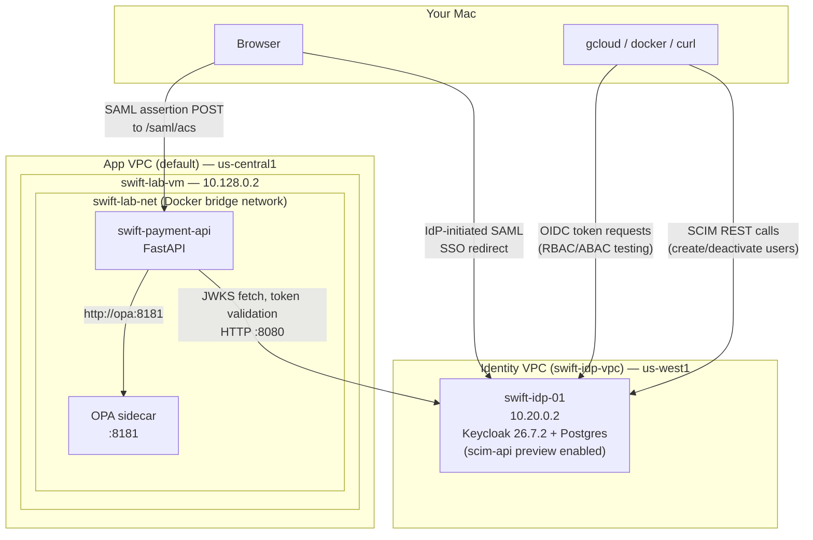

# Phase 2 Runbook — Part 2: RBAC, ABAC, SAML, SCIM

**Status:** Complete and verified end-to-end
**Covers:** Role-based authorization, attribute-based authorization (OPA), SAML identity brokering, SCIM provisioning
**Builds on:** `phase2-runbook-part1-identity-oidc.md` (VPC/Terraform infrastructure, Keycloak deployment, FastAPI OIDC integration)
**Not covered here:** none — this document closes out the full Phase 2 scope (Keycloak, OAuth2/OIDC/SAML/SCIM, RBAC/ABAC)

---

## 1. Overview & Goals

Part 1 established a working OIDC identity provider talking to the Phase 1 API — any holder of a valid Keycloak-issued token could call `submit_message`, regardless of role. This document covers the remaining Phase 2 scope: authorization on top of that authentication (RBAC, then ABAC via OPA), and the two remaining identity protocols (SAML, SCIM).

**Design principle carried through this document:** each new capability is added as its own independently testable layer — RBAC doesn't get folded into ABAC, SAML doesn't touch the OIDC code path, SCIM doesn't touch application code at all. This mirrors how a real identity platform is built incrementally, and it's what let each piece be verified in isolation before moving to the next.

---

## 2. Architecture



**Key architectural decisions:**
- OPA runs as a **sidecar on `swift-lab-vm`**, not co-located with Keycloak — see §4.1
- `swift-payment-api` acts as the **SAML Service Provider (SP)** — see §6.1
- SCIM uses **Keycloak's native SCIM API**, requiring a version upgrade — see §7.1

---

## 3. RBAC (Role-Based Access Control)

### 3.1 Purpose

Gate `POST /messages` so only tokens carrying the `payment-initiator` realm role can submit a payment message — using roles already present in the validated OIDC token from Part 1.

### 3.2 Console steps

None required. The `payment-initiator`, `payment-approver`, `payment-auditor` realm roles and the `test-initiator`/`test-approver`/`test-auditor` test users were already created in Part 1. RBAC here is pure application code, not new Keycloak configuration.

### 3.3 Code changes

**`app/src/auth/oidc.py`** — added below the existing `validate_token`:
```python
# --- RBAC: role-based authorization, built on top of the already-validated token ---
def get_roles(payload: dict) -> list[str]:
    """
    Extract realm roles from a decoded Keycloak token.
    Keycloak puts realm-level roles under realm_access.roles.
    """
    realm_access = payload.get("realm_access", {})  # {} if claim missing, avoids KeyError
    return realm_access.get("roles", [])


def require_role(*allowed_roles: str):
    """
    Dependency FACTORY — not a dependency itself. Call it with the roles you
    want to allow, e.g. Depends(require_role("payment-approver")), and it
    returns a dependency function FastAPI can actually inject.
    """
    def role_checker(payload: dict = Depends(validate_token)) -> dict:
        user_roles = get_roles(payload)
        if not any(role in user_roles for role in allowed_roles):
            raise HTTPException(
                status_code=status.HTTP_403_FORBIDDEN,
                detail=f"Requires one of roles: {allowed_roles}. Token has: {user_roles}",
            )
        return payload

    return role_checker
```

**`app/src/api/routes.py`** — swapped the dependency on the real submit endpoint:
```python
@router.post("/messages", status_code=201)
async def submit_message(msg: PaymentMessage, claims: dict = Depends(require_role("payment-initiator"))):
    ...  # rest of the function body unchanged
```
`/whoami` and `GET /messages/{message_id}` were deliberately left on `Depends(validate_token)` / no auth — RBAC only applies where a specific role should be required.

### 3.4 Command-line deploy steps

**Where: your Mac** — build and push:
```bash
cd app
# --platform linux/amd64: M-series Macs build arm64 by default; the VM needs amd64.
docker buildx build --platform linux/amd64 \
  -t us-central1-docker.pkg.dev/swift-devsecops-lab-01/swift-lab-repo/swift-payment-api:phase2-rbac \
  --push .
```

**Where: swift-lab-vm** — redeploy:
```bash
docker pull us-central1-docker.pkg.dev/swift-devsecops-lab-01/swift-lab-repo/swift-payment-api:phase2-rbac
docker stop swift-payment-api
docker rm swift-payment-api
# -v ~/keys:/app/keys:ro : the signing key lives on the VM host, not baked into the image
docker run -d --name swift-payment-api --env-file ~/.env -v ~/keys:/app/keys:ro -p 8000:8000 \
  us-central1-docker.pkg.dev/swift-devsecops-lab-01/swift-lab-repo/swift-payment-api:phase2-rbac
docker logs swift-payment-api
```

### 3.5 Test script — `~/test_rbac.sh` (on swift-lab-vm)

**Password-safety pattern used throughout every script in this document:**
- `read -sp` — hides input on screen, keeps it out of bash history
- `--data @-` (stdin) instead of `curl -d` — keeps secrets out of `ps aux` process listings
- `unset` immediately after use — clears the shell variable as soon as it's no longer needed

```bash
#!/bin/bash
set -e

KC_URL="http://10.20.0.2:8080"
REALM="swift-devsecops-lab"

# --- Admin token (master realm — see Incident 3.6.3 below) ---
read -sp "kuldeep-admin password: " ADMIN_PASS
echo
ADMIN_TOKEN=$(printf 'client_id=admin-cli&grant_type=password&username=kuldeep-admin&password=%s' "$ADMIN_PASS" \
  | curl -s -X POST "$KC_URL/realms/master/protocol/openid-connect/token" --data @- \
  | python3 -c "import sys,json;print(json.load(sys.stdin)['access_token'])")
unset ADMIN_PASS

CLIENT_UUID=$(curl -s -H "Authorization: Bearer $ADMIN_TOKEN" \
  "$KC_URL/admin/realms/$REALM/clients?clientId=swift-payment-api" \
  | python3 -c "import sys,json;print(json.load(sys.stdin)[0]['id'])")
CLIENT_SECRET=$(curl -s -H "Authorization: Bearer $ADMIN_TOKEN" \
  "$KC_URL/admin/realms/$REALM/clients/$CLIENT_UUID/client-secret" \
  | python3 -c "import sys,json;print(json.load(sys.stdin)['value'])")

get_user_token() {
  printf 'client_id=swift-payment-api&client_secret=%s&grant_type=password&username=%s&password=%s' \
    "$CLIENT_SECRET" "$1" "$2" \
    | curl -s -X POST "$KC_URL/realms/$REALM/protocol/openid-connect/token" --data @- \
    | python3 -c "import sys,json;print(json.load(sys.stdin)['access_token'])"
}

# --- test-initiator: normal submit, under threshold (expect 201) ---
read -sp "test-initiator password: " INIT_PASS
echo
INIT_TOKEN=$(get_user_token test-initiator "$INIT_PASS")
unset INIT_PASS

echo "test-initiator submitting (expect 201):"
curl -s -w "\nHTTP status: %{http_code}\n" -X POST http://localhost:8000/messages \
  -H "Authorization: Bearer $INIT_TOKEN" -H "Content-Type: application/json" \
  -d '{"sender_id":"BANKUS33XXX","receiver_id":"BANKGB2LXXX","amount":100.00,"currency":"USD","account_number":"1234567890"}'

# --- test-approver: wrong role entirely (expect 403 via RBAC) ---
read -sp "test-approver password: " APPR_PASS
echo
APPR_TOKEN=$(get_user_token test-approver "$APPR_PASS")
unset APPR_PASS

echo "test-approver submitting (expect 403 — RBAC block):"
curl -s -w "\nHTTP status: %{http_code}\n" -X POST http://localhost:8000/messages \
  -H "Authorization: Bearer $APPR_TOKEN" -H "Content-Type: application/json" \
  -d '{"sender_id":"BANKUS33XXX","receiver_id":"BANKGB2LXXX","amount":100.00,"currency":"USD","account_number":"1234567890"}'
```

### 3.6 Incidents and decisions

**3.6.1 — Missing volume mount on redeploy**

**Symptom:**
```
FileNotFoundError: [Errno 2] No such file or directory: './keys/signing_key.pem'
```

**Root cause:** the first `docker run` redeploy omitted `-v ~/keys:/app/keys:ro`. The signing key lives on the VM host filesystem, not baked into the Docker image (a deliberate security choice from Phase 1 — private key material shouldn't ship inside a container image).

**Fix:** added the volume mount to every subsequent `docker run` (shown in §3.4 above).

**3.6.2 — `noexec` on `/home`**

**Symptom:**
```
-bash: /home/testuser/test_rbac.sh: Permission denied
```
...even after `chmod +x`.

**Root cause:**
```
$ mount | grep home
/dev/sda1 on /home type ext4 (rw,nosuid,nodev,noexec,relatime,commit=30)
```
A deliberate VM hardening setting blocks direct execution of any file under `/home`, regardless of permission bits.

**Fix:** run scripts via `bash script.sh` instead of `./script.sh` — this works under `noexec` because `bash` itself lives on an executable filesystem and is just reading the script as data, not executing the file directly.

**3.6.3 — `kuldeep-admin` lives in the wrong realm**

**Symptom:** admin token requests and user lookups for `kuldeep-admin` targeting `realms/swift-devsecops-lab` failed.

**Root cause:** `kuldeep-admin` is a **master-realm** user, created there specifically as the permanent replacement for Keycloak's temporary bootstrap admin — not a `swift-devsecops-lab`-realm user like the test fixtures.

**Fix:** admin-cli token requests and admin user lookups for `kuldeep-admin` target `realms/master`; `test-initiator`/`test-approver`/`test-auditor` correctly stay under `realms/swift-devsecops-lab`.

**Decision — script-based testing over manual curl.**
- **Options considered:** ad-hoc `curl` commands run manually each session; a single reusable script
- **Chosen:** a reusable `~/test_rbac.sh` — because it enforces the password-safety pattern consistently and makes reruns (e.g., after a redeploy) trivial rather than error-prone to retype

---

## 4. ABAC via OPA (Open Policy Agent)

### 4.1 Purpose and design decision

RBAC alone can't express "this role is fine for small amounts but not large ones" — that requires evaluating an attribute of the specific request (the payment amount), not just checking role presence. OPA externalizes that decision logic into a policy file, separate from application code.

**Options considered for where OPA runs:**
- Co-locate OPA with Keycloak on `swift-idp-01`, matching the originally planned repo layout
- **Chosen: run OPA as a sidecar directly on `swift-lab-vm`** — since OPA is only ever called by the app itself, never externally, this avoids repeating the cross-VPC firewall-rule pattern already learned in Part 1, and instead teaches container-to-container Docker networking (bridge network, container-name DNS resolution) — a genuinely new concept for this project

### 4.2 Console steps

None — this section is entirely infrastructure-as-code and application code; no Keycloak admin console involvement.

### 4.3 Policy files

**`identity/opa/policies/payment_authz.rego`:**
```rego
package payment.authz

# Default deny — OPA policies should fail closed, not open.
default allow := false

# Under threshold: payment-initiator alone is sufficient.
allow if {
    input.action == "submit"
    "payment-initiator" in input.roles
    input.amount <= 10000
}

# Over threshold: payment-initiator alone is NOT enough — the token must
# ALSO carry payment-approver. This is the actual ABAC behavior: the
# decision depends on an attribute of the REQUEST, not just who the caller is.
allow if {
    input.action == "submit"
    "payment-initiator" in input.roles
    input.amount > 10000
    "payment-approver" in input.roles
}
```

**`identity/opa/tests/payment_authz_test.rego`** (run via `opa test identity/opa/policies/ identity/opa/tests/ -v` on your Mac, using the OPA CLI installed via `brew install opa`):
```rego
package payment.authz

test_small_amount_initiator_allowed if {
    allow with input as {"action": "submit", "roles": ["payment-initiator"], "amount": 5000}
}

test_large_amount_initiator_only_denied if {
    not allow with input as {"action": "submit", "roles": ["payment-initiator"], "amount": 50000}
}

test_large_amount_with_approver_allowed if {
    allow with input as {"action": "submit", "roles": ["payment-initiator", "payment-approver"], "amount": 50000}
}
```

All three tests pass locally, entirely offline — no VM, Docker, or real infrastructure involved. This proves the policy logic in isolation before adding the complexity of a live OPA server and real network calls.

### 4.4 Command-line infrastructure steps

**Where: swift-lab-vm** — create the shared Docker network and run OPA:
```bash
# Creates a user-defined bridge network so containers can resolve each other
# by name (the default bridge network does NOT support this).
docker network create swift-lab-net

# No -p port mapping needed — OPA is only reached by the app container,
# never from outside the VM.
docker run -d --name opa --network swift-lab-net -v ~/opa-policies:/policies \
  openpolicyagent/opa:latest run --server --addr=:8181 /policies
```

Copy the policy from your Mac to the VM first:
```bash
gcloud compute scp --recurse --zone us-central1-a --tunnel-through-iap \
  identity/opa/policies testuser@swift-lab-vm:~/opa-policies
```

Redeploy the app **with the network attached from the start**:
```bash
docker stop swift-payment-api
docker rm swift-payment-api
docker run -d --name swift-payment-api --network swift-lab-net --env-file ~/.env \
  -v ~/keys:/app/keys:ro -p 8000:8000 \
  us-central1-docker.pkg.dev/swift-devsecops-lab-01/swift-lab-repo/swift-payment-api:phase2-opa
```

Verify container-to-container connectivity before trusting any application-level test:
```bash
docker exec swift-payment-api python3 -c "import httpx; print(httpx.get('http://opa:8181/health').text)"
# Expect: {}
```

### 4.5 Code changes

**`oidc.py`** — added:
```python
OPA_URL = os.environ.get("OPA_URL", "http://opa:8181")  # container-name resolution via swift-lab-net

async def check_opa_authorization(action: str, roles: list[str], amount: float) -> bool:
    opa_input = {"input": {"action": action, "roles": roles, "amount": amount}}
    async with httpx.AsyncClient() as client:
        response = await client.post(f"{OPA_URL}/v1/data/payment/authz", json=opa_input, timeout=5.0)
        response.raise_for_status()
        result = response.json()
    return result.get("result", {}).get("allow", False)  # fail closed if "allow" missing
```

**`routes.py`** — `submit_message` changed to `async def`, calling OPA right after RBAC passes:
```python
user_roles = get_roles(claims)
allowed = await check_opa_authorization(action="submit", roles=user_roles, amount=float(msg.amount))
if not allowed:
    raise HTTPException(status_code=status.HTTP_403_FORBIDDEN,
        detail=f"OPA policy denied: amount {msg.amount} requires payment-approver role for amounts over threshold")
```

### 4.6 Test fixtures

Two Keycloak test users beyond what Part 1 created:
- **`test-approver`** (already existed) — proves the **RBAC boundary**: has `payment-approver` only, no `payment-initiator`, so it's blocked before OPA is ever consulted
- **`test-senior-approver`** (new, created via admin console — Users → Add user → Role mapping → assign both `payment-initiator` and `payment-approver`) — proves the **ABAC-allow boundary**: holds both roles, so a large amount is genuinely allowed, not just always denied above the threshold

### 4.7 Test script additions to `~/test_rbac.sh`

```bash
# --- test-initiator, large amount (right role, wrong attribute) — expect 403 via OPA ---
echo "test-initiator submitting large amount >10000 (expect 403, OPA denial):"
curl -s -w "\nHTTP status: %{http_code}\n" -X POST http://localhost:8000/messages \
  -H "Authorization: Bearer $INIT_TOKEN" -H "Content-Type: application/json" \
  -d '{"sender_id":"BANKUS33XXX","receiver_id":"BANKGB2LXXX","amount":50000.00,"currency":"USD","account_number":"1234567890","message_id":"test-003"}'

# --- test-senior-approver, large amount (both roles) — expect 201 ---
read -sp "test-senior-approver password: " SENIOR_PASS
echo
SENIOR_TOKEN=$(get_user_token test-senior-approver "$SENIOR_PASS")
unset SENIOR_PASS

echo "test-senior-approver submitting large amount >10000 (expect 201):"
curl -s -o /dev/null -w "%{http_code}\n" -X POST http://localhost:8000/messages \
  -H "Authorization: Bearer $SENIOR_TOKEN" -H "Content-Type: application/json" \
  -d '{"sender_id":"BANKUS33XXX","receiver_id":"BANKGB2LXXX","amount":50000.00,"currency":"USD","account_number":"1234567890","message_id":"test-005"}'
```

### 4.8 Verified results

| User | Amount | Result | Layer that decided |
|---|---|---|---|
| test-initiator | $100 | 201 | Both pass |
| test-approver | $100 | 403 | RBAC (wrong role entirely) |
| test-initiator | $50,000 | 403 | ABAC/OPA (right role, wrong attribute) |
| test-senior-approver | $50,000 | 201 | Both pass (both roles present) |

### 4.9 Decisions

**Decision — verify two distinct 403 sources, not just two 403s.**
- **Reasoning:** deliberately confirmed that RBAC-layer denials and ABAC-layer denials produce distinguishable error messages (`"Requires one of roles..."` vs `"OPA policy denied: amount..."`), proving both layers are independently functioning rather than one masking the other.

**Decision — `test-senior-approver` as a new permanent fixture, not a temporary role grant.**
- **Options considered:** temporarily grant `payment-approver` to `test-initiator` for this one test, then revert; create a dedicated permanent user
- **Chosen:** dedicated permanent user — a temporary grant-then-revert depends on remembering to revert; if forgotten, `test-initiator`'s role set silently drifts from its intended single-role purpose

---

## 5. Consolidated end-to-end verification (RBAC + ABAC)

| Test | Result |
|---|---|
| `test-initiator` submits $100 | `201` — full pipeline runs (validate, sign, encrypt, route, `acked`) |
| `test-approver` submits $100 | `403` — RBAC blocks before OPA is consulted |
| `test-initiator` submits $50,000 | `403` — RBAC passes, OPA/ABAC blocks on amount attribute |
| `test-senior-approver` submits $50,000 | `201` — both RBAC and ABAC pass |

This confirms RBAC and ABAC are genuinely two independent, composable layers — a request must clear both, and each layer's denial is distinguishable from the other's.

---

## 6. SAML

### 6.1 Purpose and design decision

Demonstrate a second identity protocol beyond OIDC. `swift-payment-api` acts as the SAML **Service Provider (SP)**; Keycloak is the **Identity Provider (IdP)**, using **IdP-initiated SSO** (no separate AuthnRequest generator needed on the app side).

**Deliberate scope decision:** full SAML signature verification (checking the assertion is genuinely signed by Keycloak's cert) needs a proper library (`python3-saml` or `signxml`) and correct certificate/keystore handling.
- **Options considered:** implement full verification now; implement decode/parse only and defer verification
- **Chosen:** decode/parse only, verification deferred to **Phase 3 (PKI/certs/mTLS)** — consistent with the existing `verify=True` JWKS TODO already deferred there from Part 1

### 6.2 Console steps

1. **Clients → Create client** → Client type: **SAML** → Client ID: `swift-payment-api-saml`
2. **Valid redirect URIs**: `http://<swift-lab-vm external IP>:8000/saml/acs*`
3. **Master SAML Processing URL**: `http://<swift-lab-vm external IP>:8000/saml/acs`
4. Confirm on Settings: **Force POST Binding** on, **Sign Documents** on (Keycloak signs even though the app doesn't verify yet — keeps the assertion structure realistic for when Phase 3 adds verification)
5. **Settings tab → IDP-Initiated SSO URL Name**: set to `swift-payment-api-saml` (see Incident 6.6.1 — blank by default, not the same as Client ID)
6. **Client scopes → `swift-payment-api-saml-dedicated` → Mappers → Configure a new mapper → Role list**: Name `realm-roles`, Role attribute name `Role`, Single Role Attribute **On** (see Incident 6.6.2)

### 6.3 Command-line steps

Get `swift-lab-vm`'s current external IP (needed for the redirect URI above — **ephemeral**, see §6.7):
```bash
gcloud compute instances describe swift-lab-vm --zone us-central1-a \
  --format="value(networkInterfaces[0].accessConfigs[0].natIP)"
```

Confirm the firewall already allows your IP on port 8000 (it does, from Phase 1):
```bash
gcloud compute firewall-rules list --format="table(name,sourceRanges.list(),allowed[].map().firewall_rule().list())"
curl -s -4 ifconfig.me   # confirm your current public IP still matches the allow-lab-app rule
```

Rebuild/redeploy after the code change:
```bash
cd app
docker buildx build --platform linux/amd64 \
  -t us-central1-docker.pkg.dev/swift-devsecops-lab-01/swift-lab-repo/swift-payment-api:phase2-saml --push .
```
```bash
docker pull us-central1-docker.pkg.dev/swift-devsecops-lab-01/swift-lab-repo/swift-payment-api:phase2-saml
docker stop swift-payment-api && docker rm swift-payment-api
docker run -d --name swift-payment-api --network swift-lab-net --env-file ~/.env \
  -v ~/keys:/app/keys:ro -p 8000:8000 \
  us-central1-docker.pkg.dev/swift-devsecops-lab-01/swift-lab-repo/swift-payment-api:phase2-saml
```

### 6.4 Code changes

**`routes.py`** — added:
```python
from fastapi import Request
from fastapi.responses import JSONResponse
import base64
import xml.etree.ElementTree as ET

SAML_NS = {
    "samlp": "urn:oasis:names:tc:SAML:2.0:protocol",
    "saml": "urn:oasis:names:tc:SAML:2.0:assertion",
}

@router.post("/saml/acs")
async def saml_acs(request: Request):
    """
    SAML Assertion Consumer Service (ACS) — receives the SAML Response
    Keycloak POSTs here after an IdP-initiated login.

    TODO(Phase 3): does NOT verify the assertion's XML signature against
    Keycloak's signing certificate. Real verification needs python3-saml /
    signxml and proper certificate handling — same PKI dependency as the
    OIDC JWKS verify=True gap already deferred there.
    """
    form = await request.form()  # SAML's HTTP-POST binding sends a form field, not JSON
    saml_response_b64 = form.get("SAMLResponse")
    if not saml_response_b64:
        raise HTTPException(status_code=400, detail="Missing SAMLResponse in POST body")

    xml_bytes = base64.b64decode(saml_response_b64)
    root = ET.fromstring(xml_bytes)

    name_id_el = root.find(".//saml:NameID", SAML_NS)
    name_id = name_id_el.text if name_id_el is not None else None

    attributes = {}
    for attr in root.findall(".//saml:Attribute", SAML_NS):
        attr_name = attr.get("Name")
        values = [v.text for v in attr.findall("saml:AttributeValue", SAML_NS)]
        attributes[attr_name] = values

    return JSONResponse({"name_id": name_id, "attributes": attributes, "note": "Signature NOT verified — Phase 3 TODO"})
```

**`requirements.txt`** — added `python-multipart` (required for FastAPI's `request.form()` parsing; a missing dependency here would only surface at runtime on the first real POST, not at container startup).

### 6.5 Testing (browser, no script — this flow is inherently interactive)

1. Open the SSO URL directly: `http://localhost:8080/realms/swift-devsecops-lab/protocol/saml/clients/swift-payment-api-saml` (via the admin tunnel)
2. Log in as a test user (fresh incognito window, or explicit Keycloak logout first — an existing session skips the login prompt entirely)
3. Browser auto-POSTs the assertion to the ACS URL; you land on the raw JSON response

### 6.6 Incidents

**6.6.1 — "Client not found" on the IdP-initiated URL**

**Symptom:**
```
We are sorry...
Client not found.
```

**Root cause:** the SSO URL path doesn't key off Client ID — it needs the separate **"IDP-Initiated SSO URL Name"** field on the client's Settings tab, blank by default even after client creation.

**Fix:** explicitly set the field to match the client ID (`swift-payment-api-saml`).

**6.6.2 — Identical junk role attribute across different users**

**Symptom:** `test-initiator` and `test-approver` both returned:
```json
{"name_id":"test-initiator","attributes":{"Role":["offline_access"]}}
{"name_id":"test-approver","attributes":{"Role":["offline_access"]}}
```
Identical output for two users with different real roles is the tell that nothing was actually reflecting per-user data.

**Root cause:** SAML clients don't automatically include realm roles in the assertion the way OIDC clients do (`realm_access.roles` comes free with OIDC; SAML needs an explicit mapper).

**Fix:** added a **Role list** mapper under Client scopes → dedicated scope → Mappers, attribute name `Role` (matching what the app code already parsed). Retested and confirmed each user now shows their own correct, distinct role:
```json
{"name_id":"test-initiator", "attributes":{"Role":[..., "payment-initiator", ...]}}
{"name_id":"test-approver",  "attributes":{"Role":[..., "payment-approver", ...]}}
{"name_id":"test-auditor",   "attributes":{"Role":[..., "payment-auditor", ...]}}
```

### 6.7 Known gap — ephemeral external IP

`swift-lab-vm`'s external IP (used in the SAML redirect URI and Master SAML Processing URL) is not reserved/static. Stopping and restarting the VM will likely assign a new IP, breaking the SAML client config (and the `allow-lab-app` firewall rule, which is also IP-scoped) until both are manually updated. Not fixed — flagged as a known limitation of the current lab setup.

---

## 7. SCIM

### 7.1 Purpose and design decision

Automate user lifecycle management (create, update, deactivate) — the piece OIDC/SAML don't cover, since they only fire at login. `swift-devsecops-lab` realm becomes the SCIM service provider; test scripts play the role of an external IdP pushing lifecycle events.

**Options considered:**
- Third-party plugin (`scim-for-keycloak`) into the existing Keycloak 26.0 — rejected: needs a custom image with a plugin JAR, and the actively-maintained version requires an enterprise license past older Keycloak versions
- Build a SCIM *receiver* into `swift-payment-api` itself (same pattern as the SAML SP) — zero risk to existing Keycloak config, but less realistic since it simulates rather than uses a genuine IdP
- **Chosen: upgrade Keycloak to a version with native SCIM support (26.6+) and use it directly** — more realistic identity-platform pattern; real risk was version-upgrade breakage, mitigated with a pre-upgrade backup (§7.2)

### 7.2 Prerequisite: Keycloak upgrade (26.0 → 26.7.2)

**Where: swift-idp-01** — back up first:
```bash
docker ps   # confirm exact container names before proceeding
docker exec keycloak-postgres pg_dump -U keycloak -d keycloak -F c -f /tmp/keycloak_backup_pre_26_7_2.dump
docker cp keycloak-postgres:/tmp/keycloak_backup_pre_26_7_2.dump ~/keycloak_backup_pre_26_7_2.dump
ls -la ~/keycloak_backup_pre_26_7_2.dump   # confirm non-zero size (213KB in this case)
```

**`identity/keycloak/docker-compose.yml`** changes (`keycloak` service only — `postgres` service untouched):
```yaml
  keycloak:
    image: quay.io/keycloak/keycloak:26.7.2   # was 26.0
    ...
    environment:
      ...
      # --- Feature flags ---
      # scim-api is a PREVIEW feature as of 26.7 (disabled by default) —
      # exposes Keycloak's native /scim/v2/... endpoints for user/group provisioning.
      KC_FEATURES: scim-api
```

Apply:
```bash
cd ~/keycloak
docker compose pull keycloak
docker compose up -d keycloak
docker logs -f keycloak   # watch for a clean startup, no migration errors
docker logs keycloak 2>&1 | grep -i scim   # confirm "Preview features enabled: scim-api:v1"
```

**Result:** clean startup, no migration errors — `Keycloak 26.7.2 ... started in 22.152s`, `Preview features enabled: scim-api:v1` confirmed at both build and runtime.

### 7.3 Console steps

1. **Clients → Create client** → Client type: **OpenID Connect** → Client ID: `scim-client`
2. Capability config: **Client authentication** On, check **Service accounts roles**
3. **Credentials tab**: set a self-chosen client secret (rather than accepting Keycloak's auto-generated one) — click **No** on any "Regenerate secret?" prompt unless deliberately rotating
4. **Service accounts roles tab → Assign role** → filter by client **realm-management** → check **manage-users**, **view-users**, **query-users**
5. **Client scopes → `scim-client-dedicated` → Mappers → Configure a new mapper → Audience**: Name `scim-audience`, **Included Custom Audience**: `http://localhost:8080/realms/swift-devsecops-lab/scim/v2` (see Incident 7.6.2 for why `localhost`, not an IP)

### 7.4 Command-line steps

**Enabling SCIM per-realm has no console UI yet** (confirmed against Keycloak's own published roadmap — this is explicitly still pending) — this step can only be done via `kcadm.sh` or the raw Admin REST API:
```bash
# Interactive login — NO --password flag, so the password is never a visible
# argument (would otherwise land in bash history and `ps aux`).
docker exec -it keycloak /opt/keycloak/bin/kcadm.sh config credentials \
  --server http://localhost:8080 --realm master --user kuldeep-admin
# (hidden password prompt)

docker exec keycloak /opt/keycloak/bin/kcadm.sh update realms/swift-devsecops-lab -s scimApiEnabled=true
```

Confirm:
```bash
curl -s -o /dev/null -w "%{http_code}\n" http://localhost:8080/realms/swift-devsecops-lab/scim/v2/Users
# Expect 401 (endpoint exists, needs auth) — 404 means scimApiEnabled didn't take
```

### 7.5 Test script — `~/test_scim.sh` (on swift-idp-01)

Full create → deactivate → verify lifecycle in one script, using a timestamp-suffixed username to avoid uniqueness conflicts on reruns:
```bash
#!/bin/bash
set -e

KC_URL="http://localhost:8080"
REALM="swift-devsecops-lab"

read -sp "scim-client secret: " CLIENT_SECRET
echo
TOKEN=$(printf 'grant_type=client_credentials&client_id=scim-client&client_secret=%s' "$CLIENT_SECRET" \
  | curl -s -X POST "$KC_URL/realms/$REALM/protocol/openid-connect/token" --data @- \
  | python3 -c "import sys,json;print(json.load(sys.stdin)['access_token'])")
unset CLIENT_SECRET

if [ -z "$TOKEN" ]; then
  echo "No token returned — check the client secret and try again."
  exit 1
fi

echo "--- Token audience claim ---"
echo "$TOKEN" | cut -d. -f2 | base64 -d 2>/dev/null | python3 -m json.tool | grep -A2 '"aud"'

USERNAME="scim-test-user-$(date +%s)"
echo "--- Creating user via SCIM ($USERNAME) ---"
CREATE_RESPONSE=$(curl -s -X POST "$KC_URL/realms/$REALM/scim/v2/Users" \
  -H "Authorization: Bearer $TOKEN" -H "Content-Type: application/scim+json" \
  -d "{\"schemas\":[\"urn:ietf:params:scim:schemas:core:2.0:User\"],\"userName\":\"$USERNAME\",\"active\":true,\"name\":{\"givenName\":\"Scim\",\"familyName\":\"Test\"},\"emails\":[{\"value\":\"$USERNAME@example.com\",\"primary\":true}]}")
echo "$CREATE_RESPONSE" | python3 -m json.tool

USER_ID=$(echo "$CREATE_RESPONSE" | python3 -c "import sys,json;print(json.load(sys.stdin)['id'])")
if [ -z "$USER_ID" ]; then
  echo "User creation failed — no id returned."
  exit 1
fi

echo "--- Deactivating user via SCIM PATCH ---"
curl -s -w "\nHTTP status: %{http_code}\n" -X PATCH "$KC_URL/realms/$REALM/scim/v2/Users/$USER_ID" \
  -H "Authorization: Bearer $TOKEN" -H "Content-Type: application/scim+json" \
  -d '{"schemas":["urn:ietf:params:scim:api:messages:2.0:PatchOp"],"Operations":[{"op":"replace","path":"active","value":false}]}'
echo

echo "--- Verifying via kcadm.sh (expect enabled: false) ---"
docker exec keycloak /opt/keycloak/bin/kcadm.sh get users -r "$REALM" -q "username=$USERNAME" 2>/dev/null \
  || echo "(kcadm session expired — re-run: docker exec -it keycloak /opt/keycloak/bin/kcadm.sh config credentials --server $KC_URL --realm master --user kuldeep-admin)"
```

### 7.6 Incidents

**7.6.1 — 404 despite the feature flag being enabled**

**Symptom:**
```
$ curl .../realms/swift-devsecops-lab/scim/v2/Users
404
```
Server log:
```
WARN [org.keycloak.scim.services.ScimRealmResourceFactory] SCIM API is not enabled for realm 'swift-devsecops-lab'
```

**Root cause:** `KC_FEATURES: scim-api` only makes the *capability* available server-wide — it does **not** enable SCIM for any specific realm.

**Fix:** the separate `scimApiEnabled` realm attribute, settable only via `kcadm.sh`/Admin API (no console UI exists for this yet — see §7.4).

**7.6.2 — The audience trap**

**Symptom:**
```json
{"schemas":["urn:ietf:params:scim:api:messages:2.0:Error"],"status":"401","detail":"Invalid token audience"}
```
...even though decoding the token showed the `aud` claim correctly contained the configured audience value.

**Root cause:** Keycloak's SCIM validator compares the audience against its own **internally configured `KC_HOSTNAME`** (hardcoded to `localhost`, per the Part 1 decision to avoid re-breaking the admin console's third-party-cookie/iframe check against a private VPC IP) — not against whatever IP the caller happens to be using. The mapper's audience was initially set to `http://10.20.0.2:8080/...` (matching the OIDC pattern used for cross-VM connectivity), which never matches `localhost`.

**Fix:** changed the mapper's audience to `http://localhost:8080/realms/swift-devsecops-lab/scim/v2` — correct as-is for testing directly on `swift-idp-01`.

**Considered and rejected: changing `KC_HOSTNAME` to the VM's IP instead.**
- This was already tried and reverted in Part 1 for a different reason (it breaks the browser admin console's iframe-based cookie check, since the Mac browser has no route to the private VPC IP)
- Changing it now would fix SCIM's audience check but reintroduce that same documented failure
- Rejected

### 7.7 Verified result

Created a user via `POST /Users` (`201`, real Keycloak user confirmed via `kcadm.sh get users` and in the admin console — same `id`, visually indistinguishable from a manually-created user). Deactivated via `PATCH /Users/{id}` with `active: false` (`200`) — confirmed via `kcadm.sh` showing `"enabled": false` on the same user record. Full protocol-to-storage chain verified.

### 7.8 Known gap — cross-VM SCIM audience

The current setup only supports SCIM calls made *directly against* `swift-idp-01` (via `localhost`). If `swift-payment-api` (on `swift-lab-vm`) ever needs to call SCIM cross-VM, it would hit the same issue OIDC already solved via decoupling `KC_BASE_URL` (connectivity) from `ISSUER` (comparison value) — but SCIM's audience check happens *inside Keycloak itself*, so there's no equivalent app-side code to patch around it. Not yet solved; flagged for a future session if cross-VM SCIM calls become necessary.

---

## 8. Concepts Covered

A working glossary of concepts this part of the phase required understanding, not just using:

| Concept | What it answers | When it runs | Direction |
|---|---|---|---|
| **RBAC** (Role-Based Access Control) | Does this role have permission to do this at all? | Per request | Checked in-app, using roles already in the token |
| **ABAC** (Attribute-Based Access Control) | Given this role AND these request-specific facts (e.g. amount), is this specific action allowed? | Per request | App → OPA (policy decision point) |
| **OPA** (Open Policy Agent) | General-purpose policy engine — the app asks "is this allowed?" and it answers based on Rego policy | Per request | App → OPA |
| **SAML** | Same question as OIDC ("who is this person, right now?"), different protocol/format (XML assertions vs JWTs) — common in enterprise SSO | At login | IdP → app (via browser POST) |
| **SCIM** (System for Cross-domain Identity Management) | Should this person have an account at all, and should they still? | Continuously, in the background, independent of login | IdP → app's SCIM API |

- **Why RBAC and ABAC are both needed, not either/or** — RBAC answers a coarse question (does this role exist on this token at all). ABAC answers a finer question that depends on the specific request — the same `payment-initiator` role is or isn't sufficient depending on the dollar amount being submitted. RBAC gates the endpoint; ABAC gates the specific action within it.
- **Why SAML and OIDC are both implemented despite solving the same problem** — different enterprise identity ecosystems favor one or the other. Demonstrating both is about protocol breadth, not because the app needs two login mechanisms simultaneously.
- **Why SCIM is a different category entirely from OIDC/SAML** — OIDC/SAML only fire when a user actively logs in. If someone is offboarded and never logs in again, an OIDC/SAML-only system's stale account can live forever. SCIM is how an IdP pushes lifecycle changes (create, update, deactivate) to downstream systems continuously, closing that gap.
- **Policy-as-code (OPA/Rego)** — authorization logic lives in a declarative policy file, versioned and testable independently of application code, rather than scattered through `if` statements
- **Fail-closed defaults** — both the OPA policy (`default allow := false`) and the app's OPA-client code (`result.get("result", {}).get("allow", False)`) default to deny on any ambiguous or malformed response, rather than accidentally defaulting to allow
- **Service accounts / client-credentials grant** — a machine-to-machine authentication pattern (used by `scim-client`) distinct from the password-grant flow used for human test users; no user is involved at all, the client authenticates as itself
- **Realm-scoped vs. instance-scoped configuration in Keycloak** — some settings (like `KC_FEATURES`) are set at the server/instance level via environment variables; others (like `scimApiEnabled`) are per-realm attributes set via the Admin API — conflating the two was the direct cause of Incident 7.6.1
- **IdP-initiated vs. SP-initiated SSO** — IdP-initiated (used here for SAML) means the flow starts at the identity provider's own URL; SP-initiated means the flow starts at the application, which redirects to the IdP. IdP-initiated avoids needing to build an AuthnRequest generator, at the cost of being a less common real-world entry point

---

## 9. Phase 2 status: complete

With RBAC, ABAC, SAML, and SCIM all built and verified in this document, **Phase 2 (Keycloak, OAuth2/OIDC/SAML/SCIM, RBAC/ABAC) is fully complete.** Nothing remains in Phase 2 scope. The `phase-2-identity-auth` branch is ready to be merged into `main` once this document and its companion (Part 1) are both committed — see the Appendix for the actual git commands used.

## Deferred to Later Phases (not Phase 2 scope)

- **SAML assertion signature verification** — Phase 3 (PKI, certificates & machine identity), alongside the existing OIDC JWKS `verify=True` TODO
- **Real TLS/HTTPS for Keycloak** — Phase 3
- **Cross-VM SCIM audience resolution** (§7.8) — not yet needed, not yet solved; revisit if a cross-VM SCIM caller becomes necessary
- **`swift-lab-vm`'s ephemeral external IP breaking SAML client config on VM restart** (§6.7) — not fixed, documented limitation
- **Centralizing credentials** (currently a personal password manager) **into Vault/GSM** — Phase 4
- **`POSTGRES_PASSWORD` printed in plaintext to the terminal** once while confirming DB credentials for the pre-upgrade backup — low risk (lab-only, internal-only Postgres), but a rotation candidate

---

## 10. Test fixture reference

| User | Roles | Purpose |
|---|---|---|
| `test-initiator` | `payment-initiator` | RBAC pass case; ABAC pass case (under threshold) |
| `test-approver` | `payment-approver` | RBAC boundary — blocked, proves role check works |
| `test-senior-approver` | `payment-initiator` + `payment-approver` | ABAC boundary — allowed, proves attribute + role combination works |
| `test-auditor` | `payment-auditor` | Reserved, intentionally unused (no `/audit` endpoint built yet) |
| `kuldeep-admin` | `admin` (master realm) | Permanent Keycloak admin — **lives in `master`, not `swift-devsecops-lab`** |
| `scim-client` | service account (`manage-users`, `view-users`, `query-users` on `realm-management`) | SCIM protocol client — not a human user |

---

## Appendix: Git Workflow Reference (Part 2 additions)

Continuing the consolidated git reference from Part 1's appendix — this section covers only the commits made during Part 2's work. See Part 1's appendix for repo setup, branching, and general workflow conventions, which apply unchanged here.

### Commits landed during Part 2

Each capability landed as its own commit, independently reviewable and revertable — same discipline as Part 1:

```bash
# RBAC
git add app/src/api/routes.py app/src/auth/oidc.py
git commit -m "Phase 2 Part 2: add RBAC enforcement via require_role dependency"
git push
# -> commit 7fbcbdd, 2 files changed, 41 insertions(+), 1 deletion(-)

# ABAC / OPA
git add app/src/api/routes.py app/src/auth/oidc.py identity/opa/
git commit -m "Phase 2 Part 2: add ABAC enforcement via OPA sidecar (amount-threshold policy)"
git push
# -> commit f2934a7, 4 files changed, 101 insertions(+), 4 deletions(-)

# SAML
git add app/src/api/routes.py app/requirements.txt
git commit -m "Phase 2 Part 2: add SAML SP (/saml/acs endpoint, IdP-initiated SSO)"
git push
# -> commit 7517337, 2 files changed, 53 insertions(+), 1 deletion(-)
```

**Note on SCIM:** no application code commit was needed — all SCIM setup (Keycloak version upgrade, `scim-client`, mappers, `scimApiEnabled`) lives in Keycloak configuration and `identity/keycloak/docker-compose.yml`, not `swift-payment-api` itself.

### Pre-existing cleanup caught along the way

```bash
# A stray untracked duplicate file was found and removed during the RBAC commit —
# confirmed via diff to be byte-identical to the already-tracked docs/phase1-runbook.md,
# and confirmed via `git log --all` to have never been tracked on any branch.
diff docs/phase1-runbook.md docs/phase1-runbook_after_lab_completion.md   # empty output = identical
rm docs/phase1-runbook_after_lab_completion.md   # plain rm, not git rm — git never tracked it
git status   # confirmed clean working tree afterward
```

**Principle followed, consistent with Part 1's appendix:** never assume a file's git status — verify (`git log --all`, `diff`) before deciding whether `rm` or `git rm` is the correct removal command.

### Verification before each commit

Same discipline as Part 1 — `git status` run immediately after `git add`, before every commit, to confirm exactly the intended files were staged and nothing else was swept in (e.g., confirming `identity/opa/` policy files were included in the ABAC commit, or confirming the stray runbook duplicate stayed *out* of the RBAC commit).

### Merge readiness

With this document complete, `phase-2-identity-auth` is ready for a pull request into `main`, per the convention established in Part 1's appendix: a branch is opened as a PR only once its entire phase is complete, giving one coherent, fully-documented unit to review rather than a string of partial merges.
