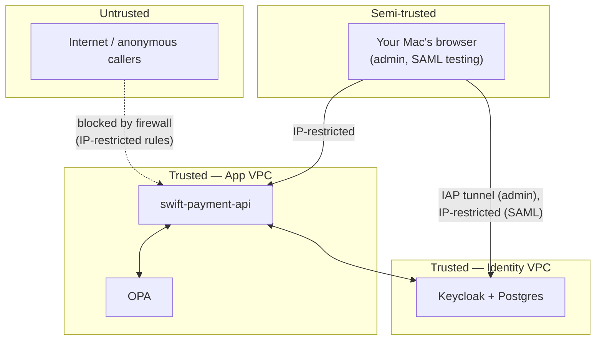

# Threat Model

**Scope:** Phase 1 (core messaging API) + Phase 2 (identity, RBAC/ABAC, SAML, SCIM), as they exist right now. This is a snapshot, not a hypothetical fully-hardened design — several threats identified below are known, accepted, and explicitly deferred to a later phase, and are documented that way rather than glossed over. See `docs/decisions.md` for the reasoning behind each deferral.

**Method:** STRIDE (Spoofing, Tampering, Repudiation, Information Disclosure, Denial of Service, Elevation of Privilege), applied per component and per data flow.

---

## 1. Assets

| Asset | Why it matters |
|---|---|
| Payment message content (sender, receiver, amount, account number) | Financial data — the core thing this system exists to protect |
| Signing private key | Compromise lets an attacker forge messages that appear authentically signed |
| AES encryption key | Compromise lets an attacker decrypt account numbers |
| Keycloak realm configuration (clients, roles, users, credentials) | Compromise of the identity provider compromises everything downstream |
| Bearer tokens (OIDC access tokens, SAML assertions, SCIM tokens) | Theft or forgery grants unauthorized access to the API |
| OPA policy | A tampered policy could silently change authorization decisions across every request |

---

## 2. Trust boundaries and actors

**Actors:**
- **Legitimate test users** (`test-initiator`, `test-approver`, etc.) — human, authenticate via password grant
- **The app itself** (`swift-payment-api`) — machine, authenticates via client secret / service account
- **`scim-client`** — machine, no human involved, client-credentials grant
- **An attacker** — assumed to potentially have network access to the public internet, and (worst case for this model) knowledge of the repo's source code, since it's public on GitHub

---

## 3. Threats by component (STRIDE)

### 3.1 Keycloak (identity provider)

| Threat | Category | Current state | Severity |
|---|---|---|---|
| Traffic between the browser/app and Keycloak is unencrypted (`start-dev`, HTTP on 8080, not HTTPS on 8443) | **Information Disclosure**, Tampering | **Present.** Anyone with network access to the path between client and Keycloak could read or modify tokens/credentials in transit. Mitigated somewhat by network scope (private VPC, IP-restricted firewall rules) but not by encryption. | High — deferred to Phase 3 |
| Keycloak admin console has no MFA configured | Spoofing | **Present.** A leaked `kuldeep-admin` password alone is sufficient for full admin access. | Medium — not yet addressed in any phase plan |
| JWKS fetch does not validate Keycloak's certificate (effectively `verify=False`-equivalent, since there's no HTTPS listener to verify against yet) | Spoofing, Tampering | **Present**, same root cause as the HTTP-only issue above. | High — deferred to Phase 3 |
| `POSTGRES_PASSWORD` was briefly visible in a terminal session (plaintext, via `docker exec ... env`) | Information Disclosure | **One-time exposure, not ongoing** — logged as a rotation candidate in `secure-notes/credentials-index.md`, not yet rotated. | Low (lab-only, internal-only Postgres, exposure was momentary and local) |
| SCIM's per-realm enablement (`scimApiEnabled`) has no admin console UI — only `kcadm.sh`/API | Elevation of Privilege (indirectly) | Not itself a vulnerability, but a UI gap that increases the chance of a misconfiguration going unnoticed, since it can't be visually audited in the console the way most other settings can. | Low |

### 3.2 `swift-payment-api` (the app)

| Threat | Category | Current state | Severity |
|---|---|---|---|
| SAML assertions are not cryptographically verified — the app trusts the XML content without checking Keycloak's signature | **Spoofing** — an attacker who could intercept or forge a POST to `/saml/acs` could inject arbitrary identity claims | **Present**, explicitly flagged in code (`TODO(Phase 3)`) and in every relevant doc. | High — deferred to Phase 3 |
| The signing private key and AES key live as files/env vars on the VM host, not in a secrets manager | Information Disclosure | **Present.** Anyone with VM access (or a leaked backup of the VM's filesystem) gets both keys directly. | Medium — deferred to Phase 4 (Vault/GSM) |
| Message store is in-memory only, no persistence, no audit trail survives a restart | Repudiation | **Present** — a deliberate Phase 1 simplification, not a Phase 2/3 concern, but worth naming: there's currently no way to prove after the fact that a given message was ever submitted, once the process restarts. | Low for this lab's purposes, would be high in a real system |
| RBAC/ABAC checks happen entirely inside the app process — no external audit trail of authorization *decisions* (only the final HTTP response) | Repudiation | **Present.** OPA's decision isn't separately logged anywhere durable. | Low-Medium |
| No rate limiting on `/messages`, `/saml/acs`, or any endpoint | Denial of Service | **Present** — no protection against a flood of requests. | Low for a lab; would be a real concern in production |

### 3.3 OPA (policy engine)

| Threat | Category | Current state | Severity |
|---|---|---|---|
| The OPA sidecar has no port exposed to the host or outside the VM, but is unauthenticated on its internal network — any process able to reach `swift-lab-net` could query or (with the right API) modify its loaded policy | **Tampering**, Elevation of Privilege | **Present**, but low practical risk given the network is scoped to a single VM's Docker bridge, not reachable externally. | Low |
| The policy file itself has no integrity check between what's in git and what's actually loaded on the running OPA instance | Tampering | **Present** — nothing currently verifies the deployed policy matches the committed one. | Low-Medium |

### 3.4 SCIM

| Threat | Category | Current state | Severity |
|---|---|---|---|
| `scim-client`'s service account has `manage-users` — broad enough to create, modify, or deactivate *any* user in the realm, not scoped to any subset | Elevation of Privilege | **Present**, and arguably necessary for SCIM to function at all — but worth naming as a concentration of privilege in one client credential. | Medium |
| No rate limiting or anomaly detection on SCIM's create/deactivate operations | Denial of Service (of the user directory itself — mass account creation or deactivation) | **Present.** | Low for this lab |

### 3.5 Cross-cutting: the repo itself is public

| Threat | Category | Current state | Severity |
|---|---|---|---|
| Source code, including every architectural decision and every bug's root cause, is publicly readable | Information Disclosure | **Accepted, deliberate** — this is a portfolio project, and the transparency is the point. Mitigated by keeping all actual secrets (credentials, keys) out of the repo entirely (`secure-notes/`, `.env` files, personal password manager) — the *code* being public doesn't mean *secrets* are public, and that separation has been actively maintained (see `docs/decisions.md` D17 for the reasoning). | N/A — accepted risk, not a gap |
| A `gcloud` account/project mismatch nearly led to a command being run against the wrong project (caught before any damage — see `docs/decisions.md` B16) | Elevation of Privilege (accidental, not malicious) | **Resolved** for this specific incident, but the underlying human-error risk (multiple GCP projects/accounts active on one machine) remains structurally present. | Low, procedural mitigation only (double-checking `gcloud config list` before sensitive commands) |

---

## 4. Summary: what's genuinely accepted risk vs. what's a real gap

**Deliberately deferred, tracked, and reasoned about (not oversights):**
- No TLS on Keycloak → Phase 3
- SAML signature not verified → Phase 3
- JWKS certificate not validated → Phase 3
- Secrets in a password manager, not Vault/GSM → Phase 4

**Genuinely open, not yet scheduled into any phase:**
- No MFA on the Keycloak admin console
- No rate limiting anywhere
- No durable audit trail for authorization decisions (only the HTTP response, not a persisted log of OPA's reasoning)
- `scim-client`'s broad `manage-users` scope isn't narrowed further
- No policy-integrity check between committed Rego and deployed Rego

**Accepted, by design, not a gap:**
- Public repo / public source code — secrets are kept out via a maintained, verified separation, not by obscurity

---

## 5. If this were going to production (not this lab's goal, but worth naming)

The single highest-leverage fix would be **Phase 3's TLS/PKI work** — it closes three of the four "High" severity items in one pass (Keycloak transport encryption, JWKS cert validation, and it's the prerequisite for SAML signature verification too, since verification needs Keycloak's real signing certificate). Everything else in this document is genuinely lower priority by comparison.
